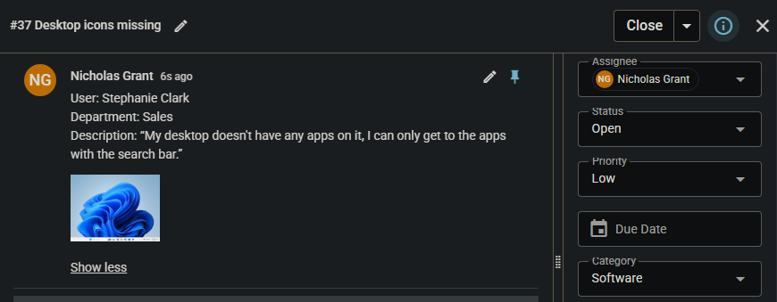
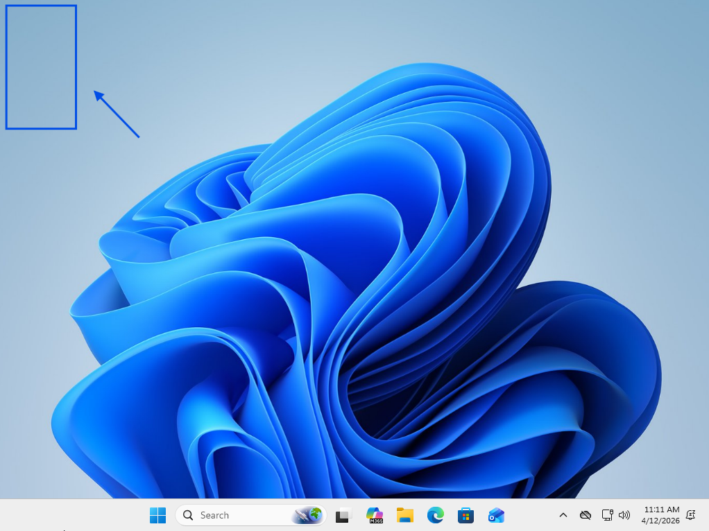
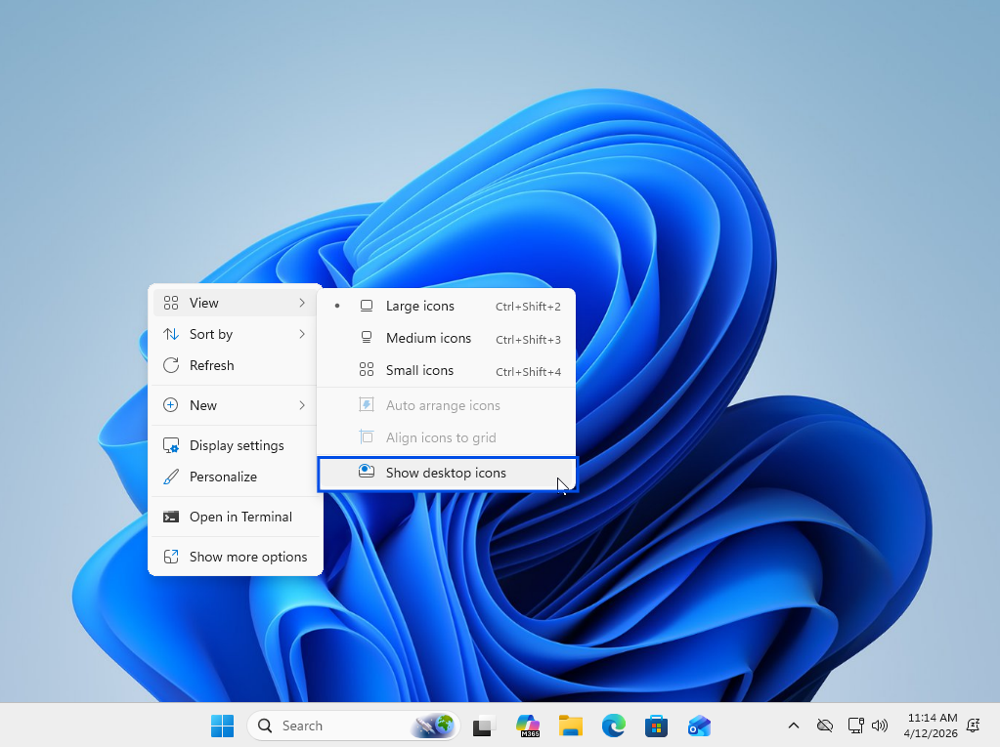
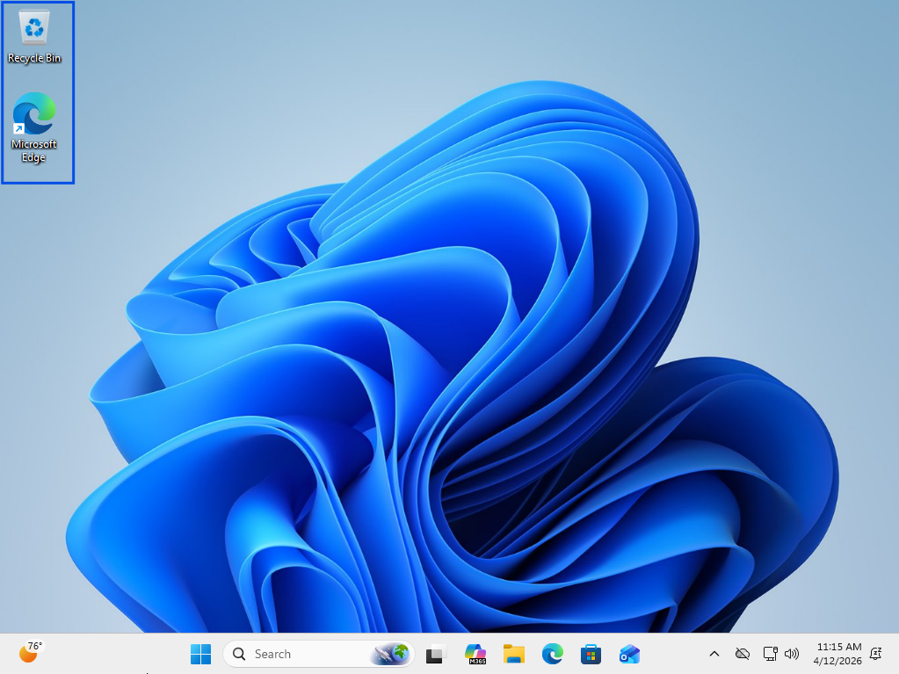
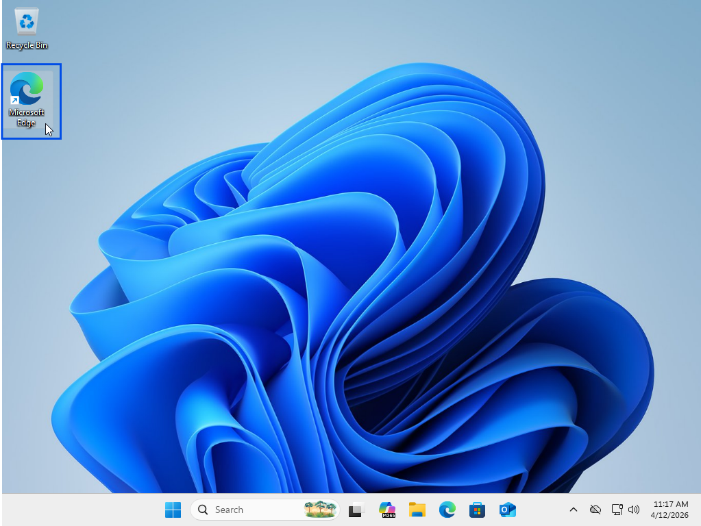

# Desktop Icon Visibility Disabled – UI Restoration

## Summary
User interface issue caused by disabled desktop icon visibility setting.

## User
Stephanie Clark

## Department
Sales

## Issue
User unable to view desktop icons, impacting access to applications and files.

---

## Troubleshooting
- Validated missing desktop icons on user system  
- Confirmed desktop environment functioning normally  
- Accessed desktop **View settings** via context menu  
- Identified **“Show desktop icons”** setting disabled  

---

## Resolution
- Re-enabled desktop icon visibility setting  
- Restored standard user interface functionality  
- Verified application access from desktop  

---

## Screenshots

### 1. Ticket (Spiceworks)

### 2. Reported Issue

### 3. Troubleshooting Steps

### 4. Issue Resolved (Working State)

### 5. Verification (Application Launch)

