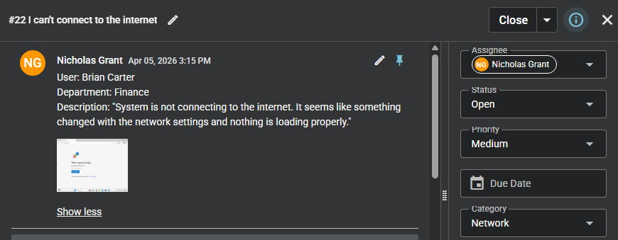
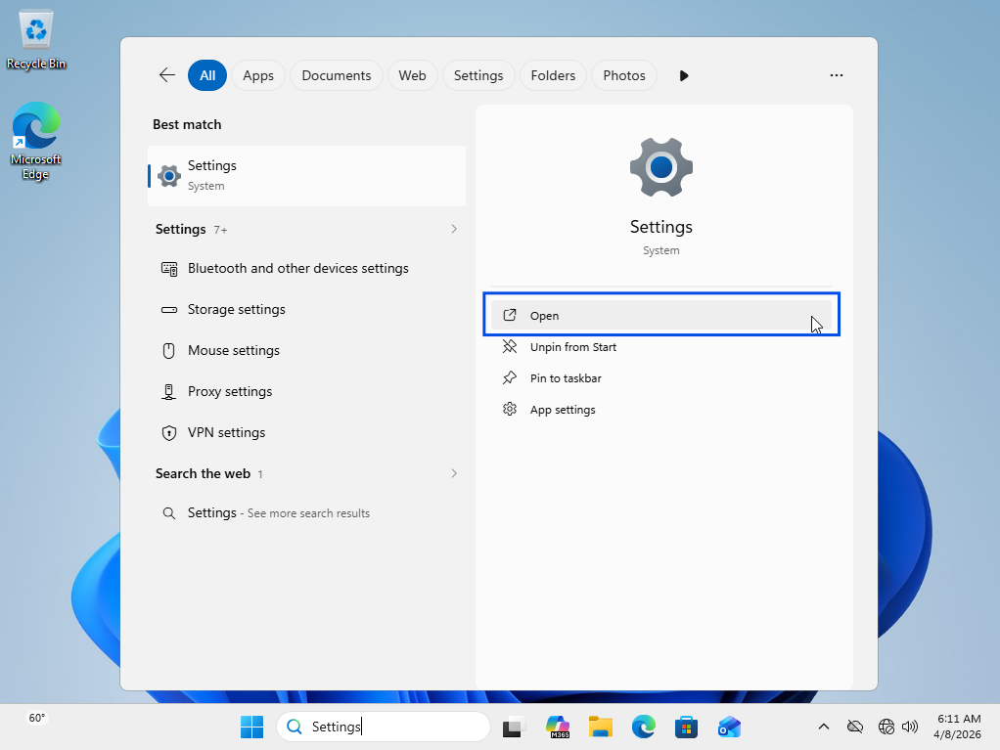
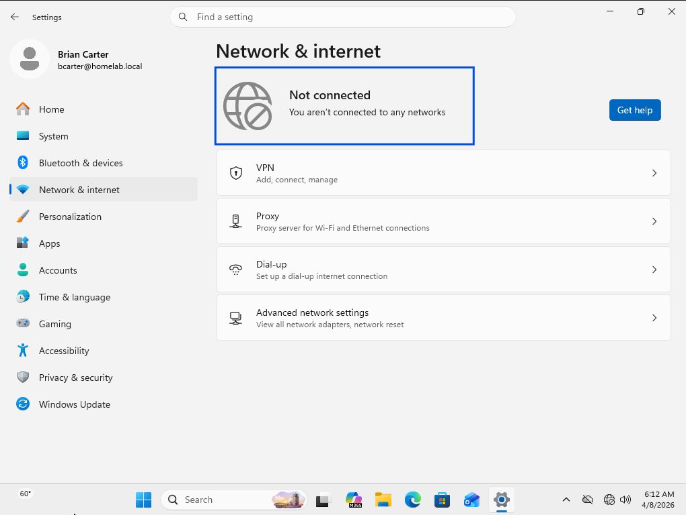
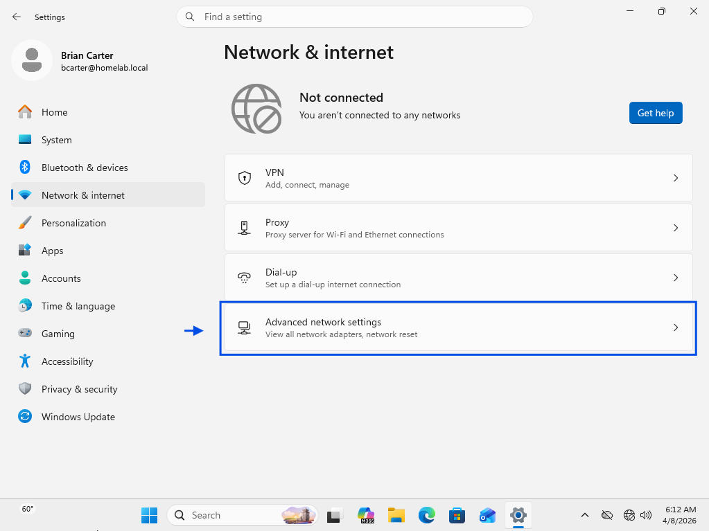
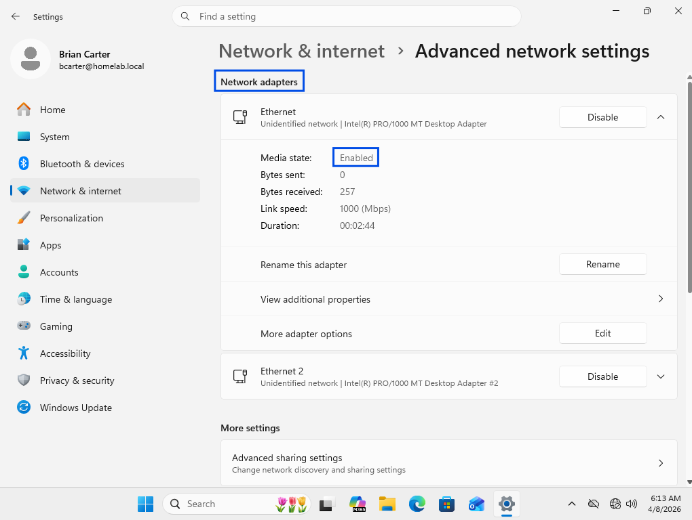
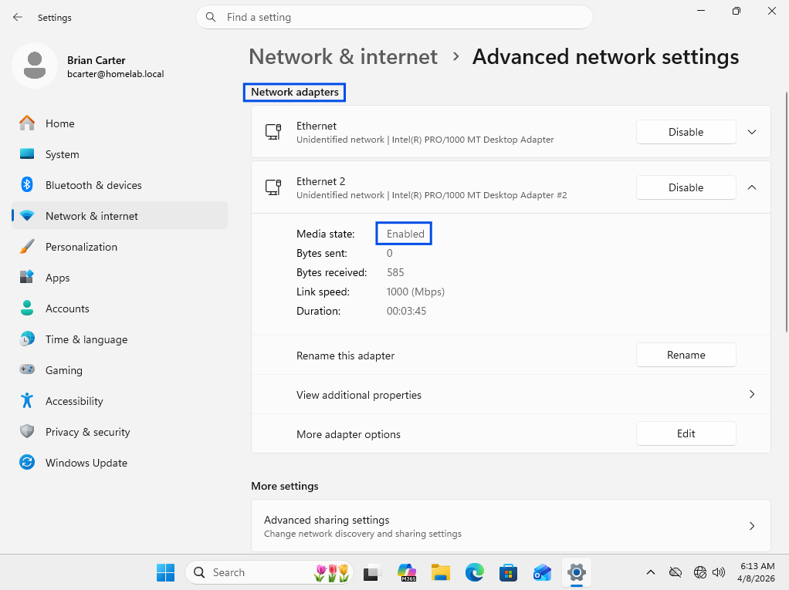
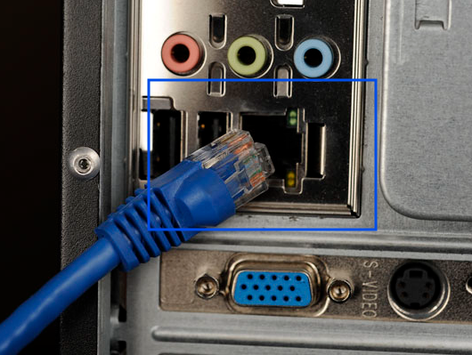
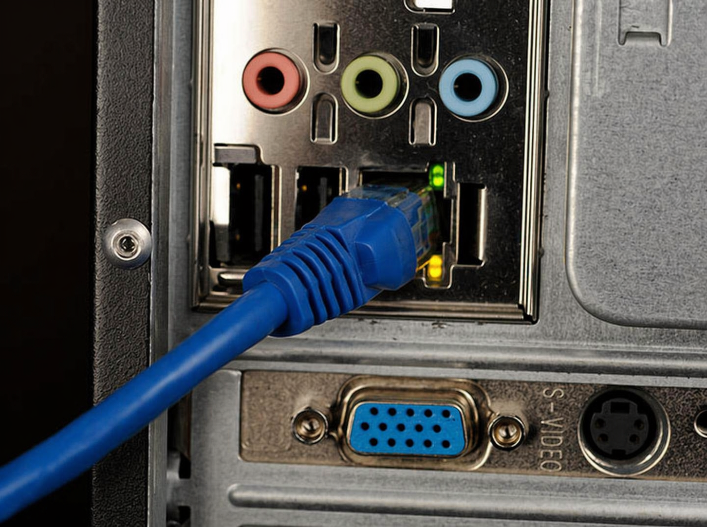
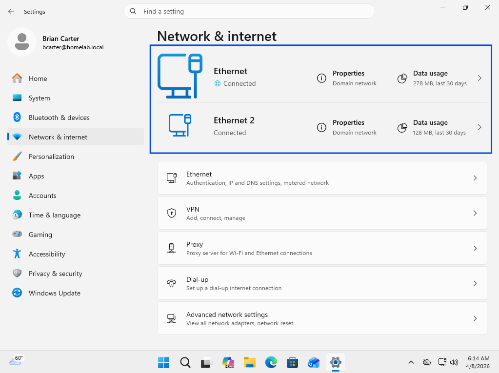

# Physical Network Connectivity Failure – Ethernet Cable Restored

## Summary
Network connectivity failure caused by disconnected physical Ethernet connection.

## User
Brian Carter

## Department
Finance

## Issue
User unable to access internet or external resources due to loss of network connectivity.

---

## Troubleshooting
- Validated lack of internet access via browser  
- Observed **no network connection status** (system offline)  
- Confirmed wired (Ethernet) network configuration  
- Isolated issue to **physical connectivity layer (Layer 1)**  
- Inspected network connection and identified disconnected Ethernet cable  

---

## Resolution
- Reconnected Ethernet cable to workstation  
- Restored network link and connectivity  
- Verified active network status  
- Confirmed successful access to external resources  

---

## Screenshots

### 1. Ticket (Spiceworks)

### 2. Reported Issue

### 3. Troubleshooting Steps

### 4. Issue Resolved (Working State)

