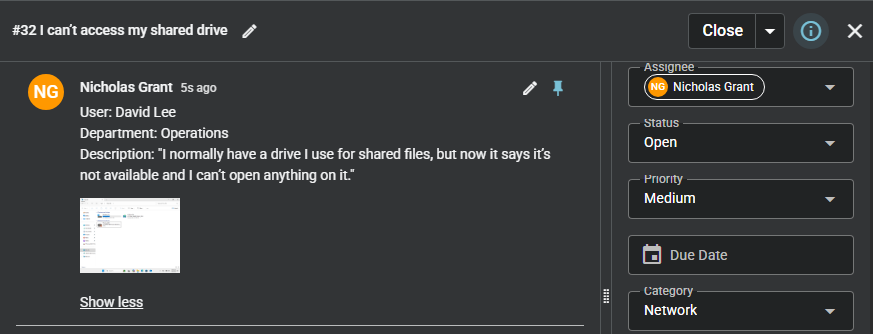

# Cannot Access Shared Drive

## Summary
User unable to access shared network drive.

## User
David Lee

## Department
Operations

## Issue
User reports that the shared drive is unavailable and cannot be opened.

---

## Troubleshooting
- Verified shared drive status in File Explorer (red X present)
- Attempted to access shared drive and reviewed error message
- Tested connectivity to host device using ping
- Identified no network connectivity (packet loss)
- Checked network status from taskbar (no internet connection)
- Accessed Network and Internet settings
- Navigated to advanced network settings
- Identified disabled network adapters
- Re-enabled Ethernet adapters
- Retested connectivity using ping (successful response)
- Verified shared drive accessibility

---

## Resolution
- Enabled disabled network adapters
- Restored network connectivity
- Re-established communication with host device
- Confirmed shared drive is accessible
- Verified user can view and access files

---

## Screenshots

### 1. Ticket (Spiceworks)

### 2. Reported Issue

### 3. Troubleshooting Steps

### 4. Issue Resolved (Working State)

