# Domain Account Lockout – Password Reset and Access Restoration

## Summary
User authentication failure caused by Active Directory account lockout following multiple failed login attempts.

## User
Cynthia Evans

## Department
Sales

## Issue
User unable to authenticate due to account lockout.  
Error: *“The referenced account is currently locked out and may not be logged on to.”*

---

## Troubleshooting
- Reviewed lockout error and confirmed repeated failed authentication attempts  
- Accessed **Active Directory Users and Computers (ADUC)**  
- Located user account and verified **lockout status**  
- Identified account lockout as root cause  
- Unlocked account and initiated secure password reset  

---

## Resolution
- Cleared account lockout in Active Directory  
- Reset user password and enforced credential update  
- Restored user authentication access  
- Verified successful login and account functionality  

---

## Screenshots

### 1. Ticket (Spiceworks)
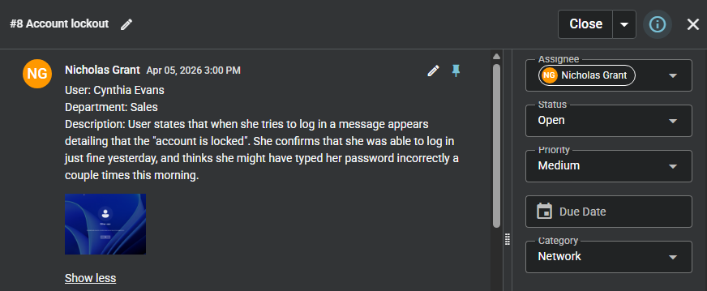

### 2. Reported Issue
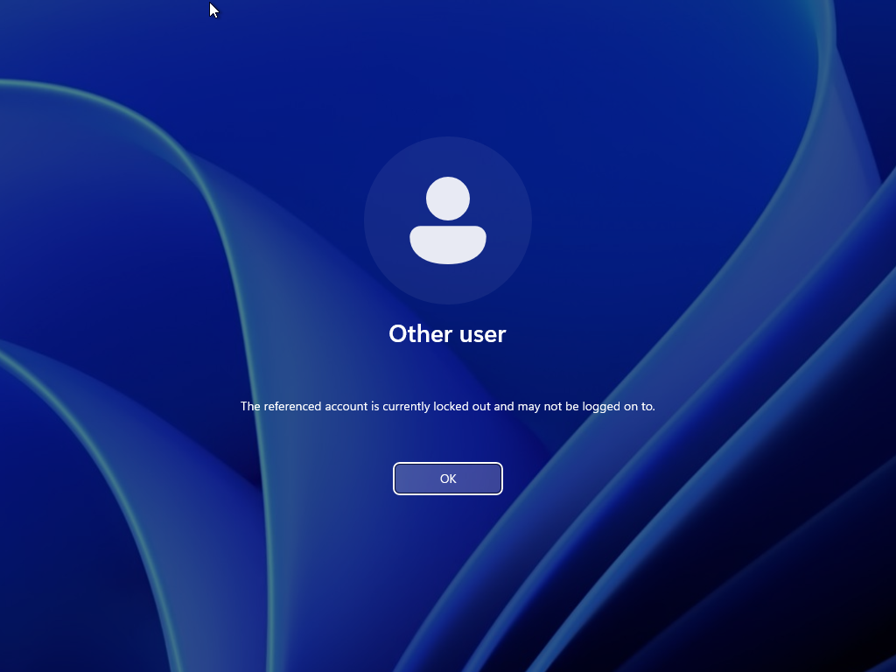

### 3. Troubleshooting Steps

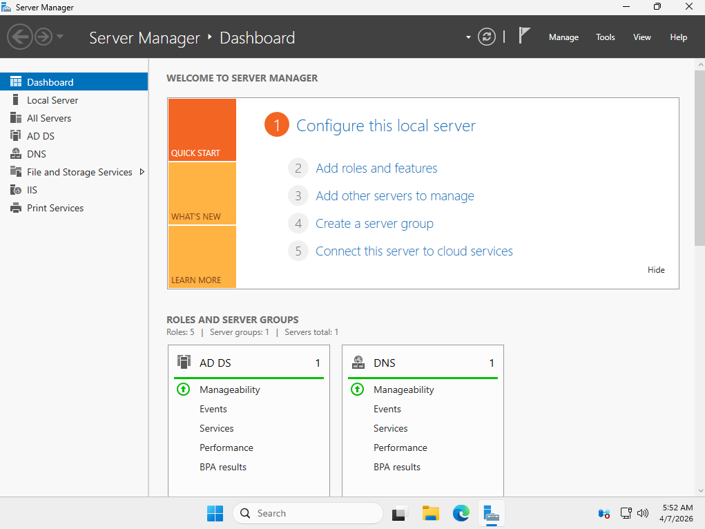

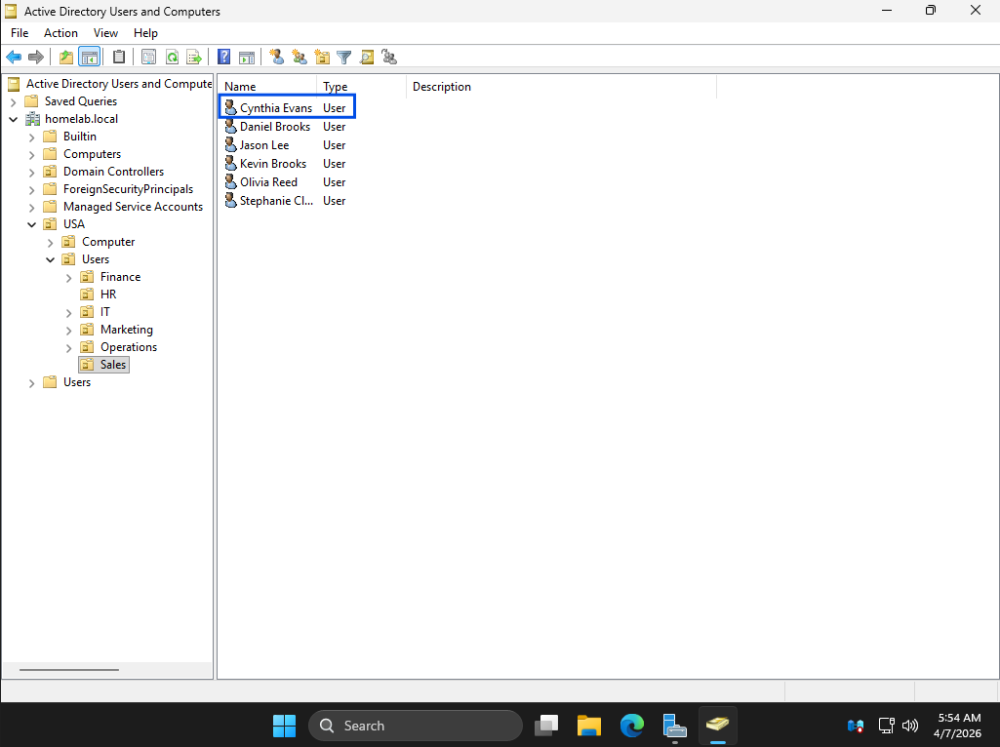
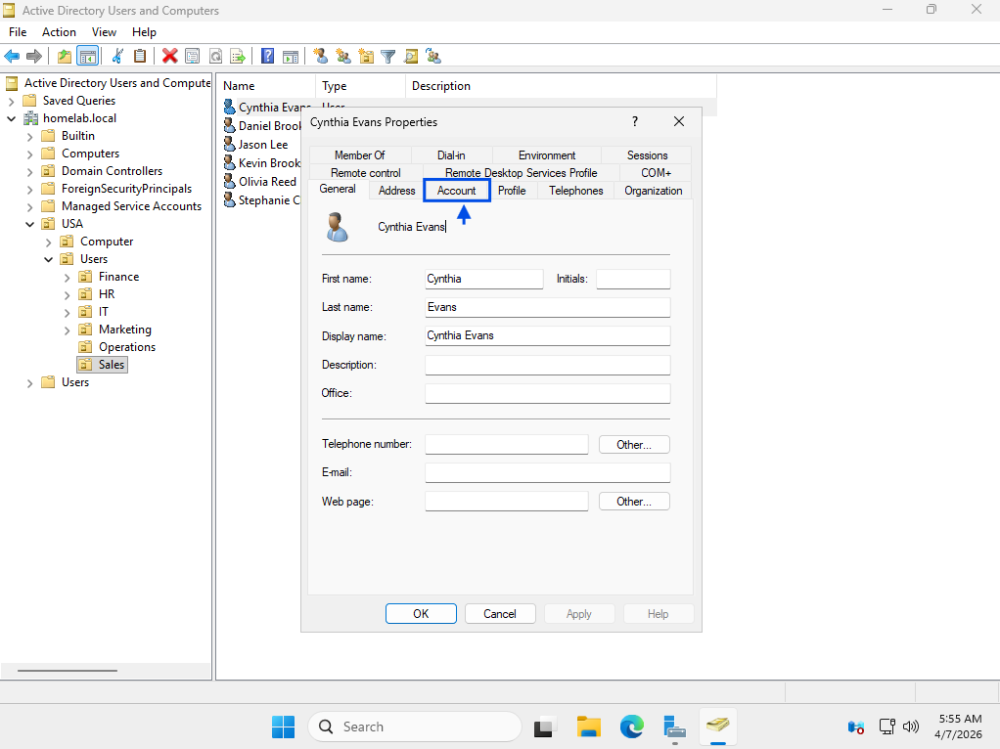
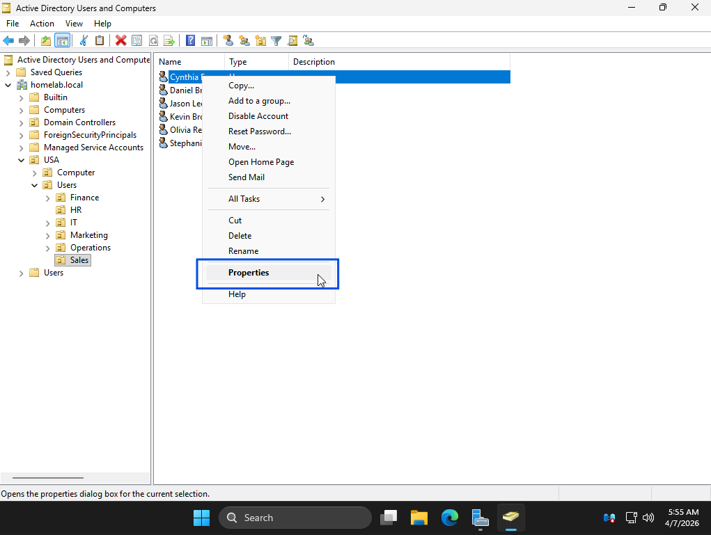
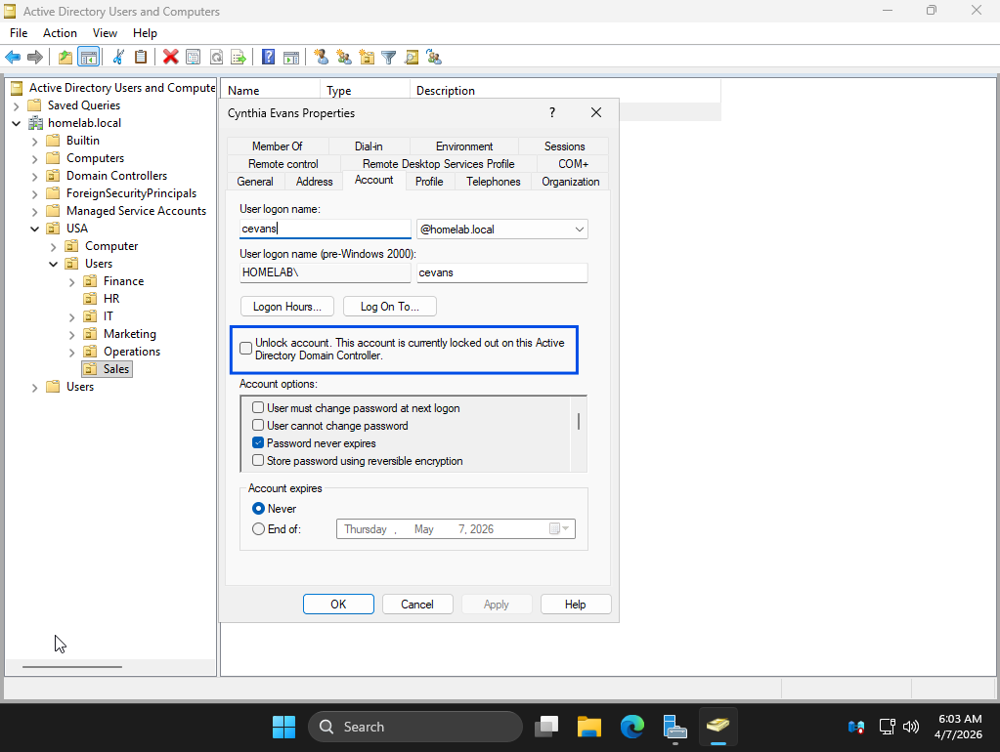
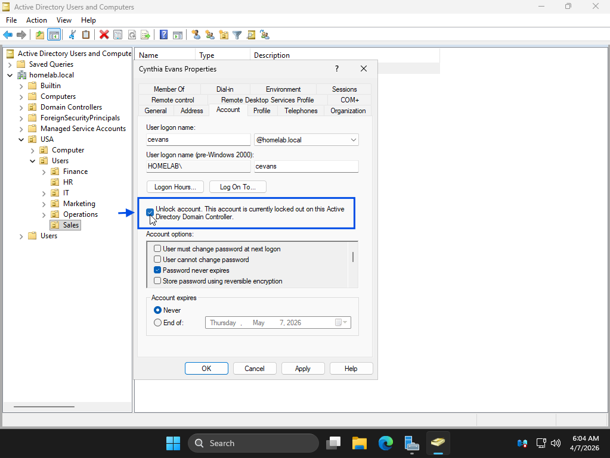
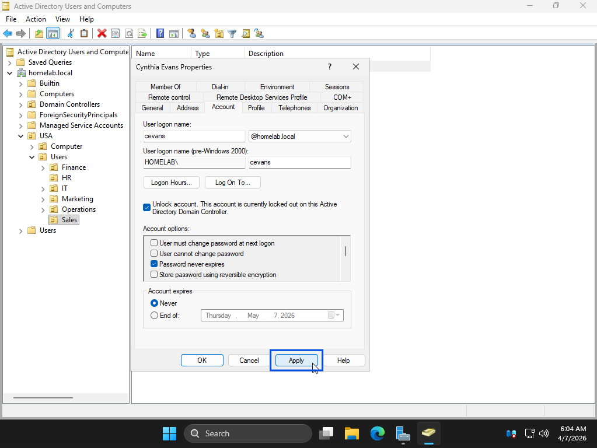
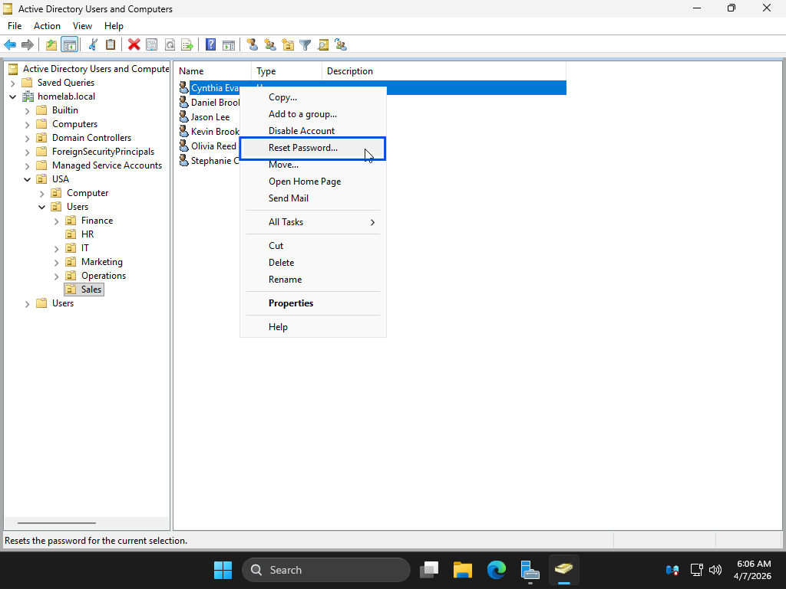
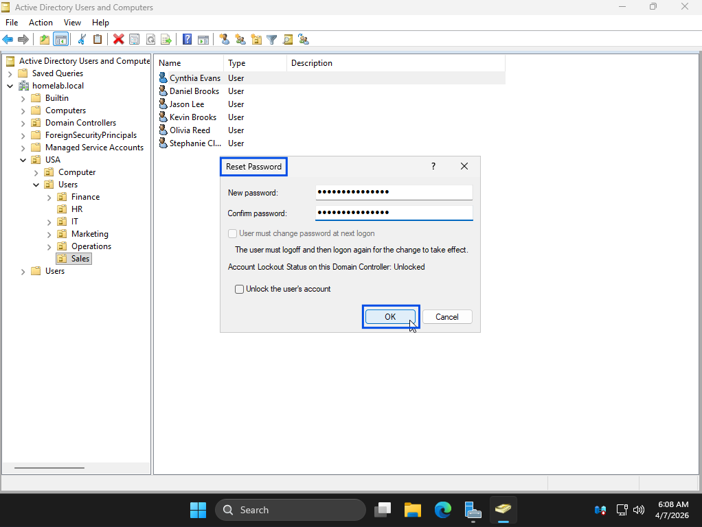

### 4. Issue Resolved (Working State)
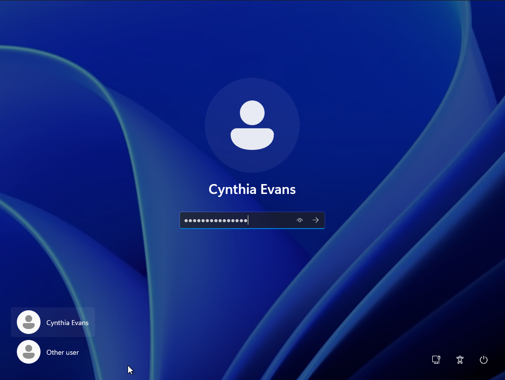
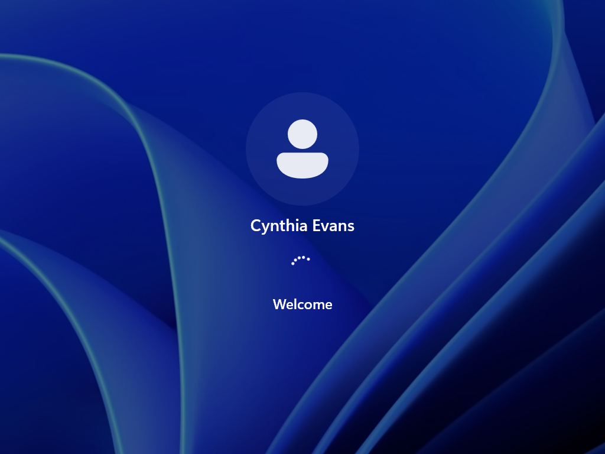
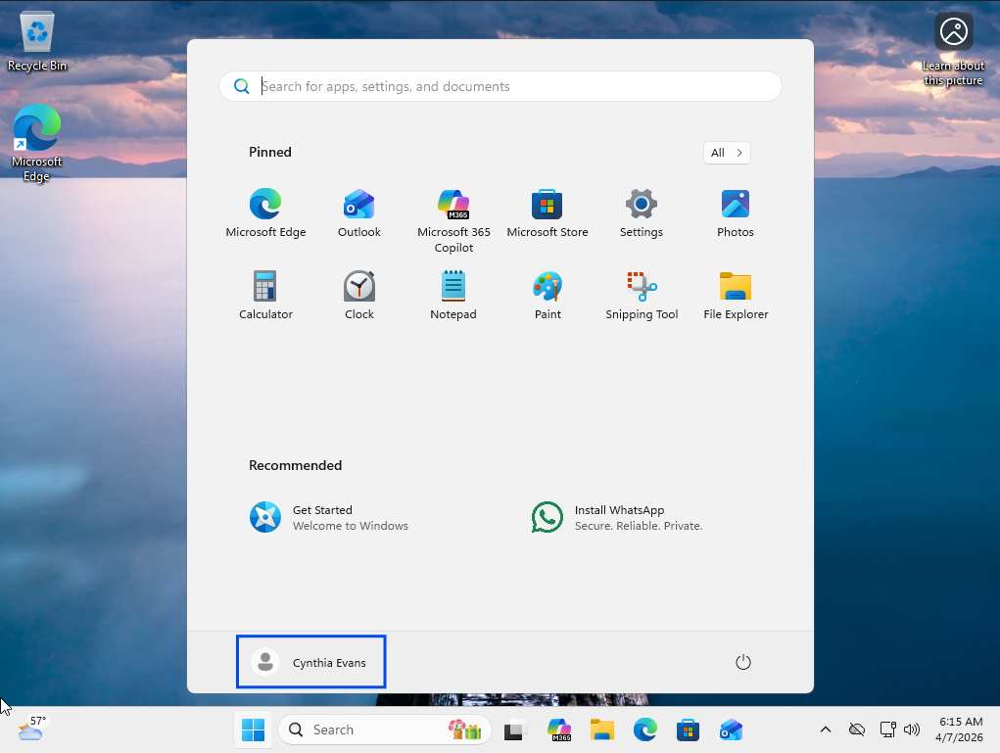
