# Domain Logon Hours Restriction – Policy Adjustment

## Summary
Authentication failure caused by Active Directory logon hours policy restricting user access outside approved timeframe.

## User
Marcus Johnson

## Department
Operations

## Issue
User unable to authenticate after business hours despite valid credentials.  
Access restricted by configured logon hours policy.

---

## Troubleshooting
- Validated login failure during restricted time window  
- Identified issue as **policy-based access restriction (logon hours)**  
- Accessed **Active Directory Users and Computers (ADUC)**  
- Located user account and reviewed **Logon Hours configuration**  
- Confirmed access limited to standard business hours  
- Determined requirement for extended access window  

---

## Resolution
- Updated **logon hours policy** to include approved timeframe  
- Applied changes to user account in Active Directory  
- Restored authentication access outside standard hours  
- Verified successful login and policy enforcement  

---

## Screenshots

### 1. Ticket (Spiceworks)

### 2. Reported Issue

### 3. Troubleshooting Steps
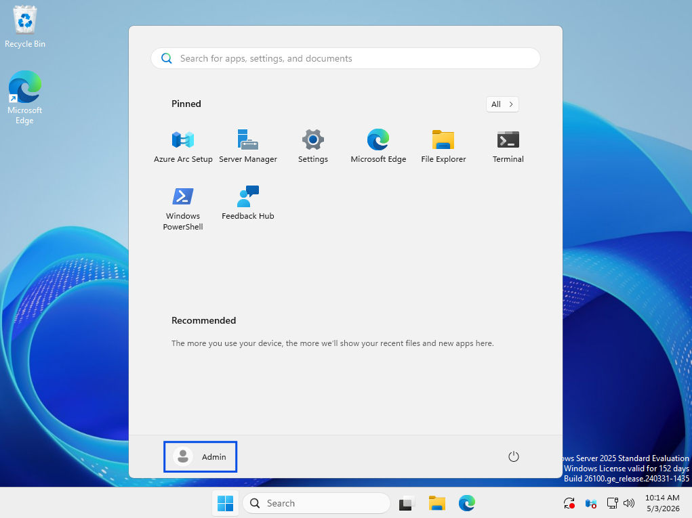

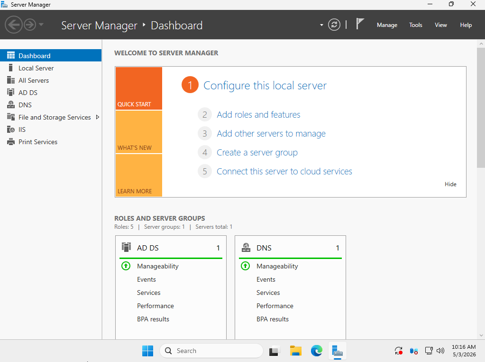
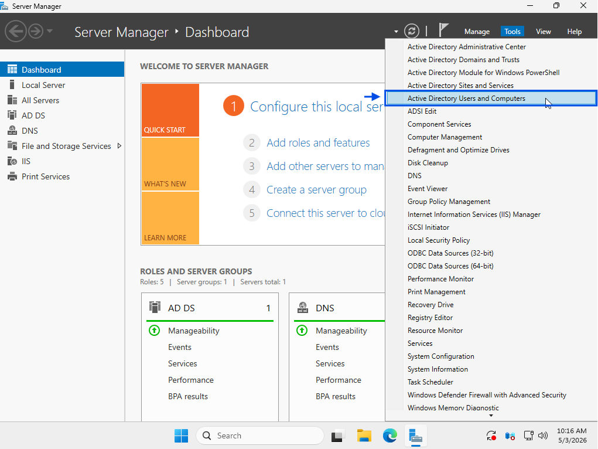
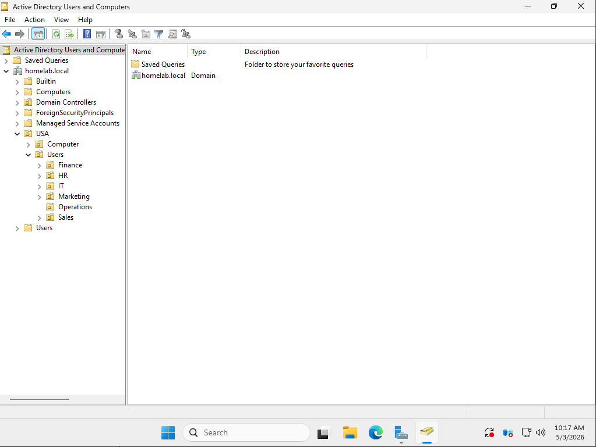

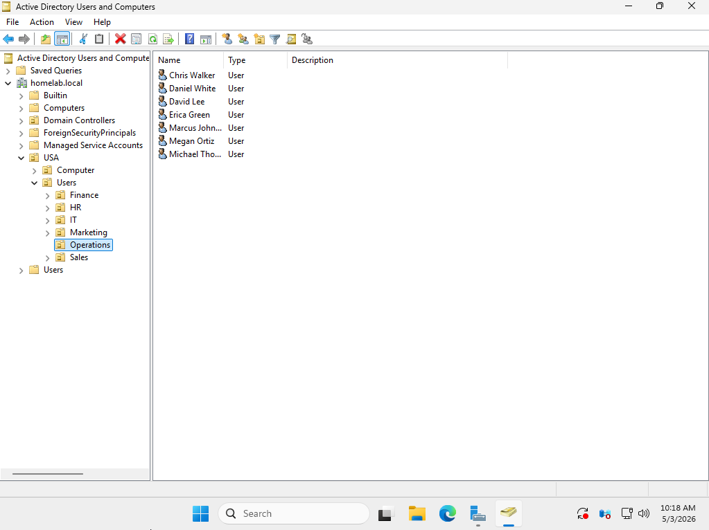

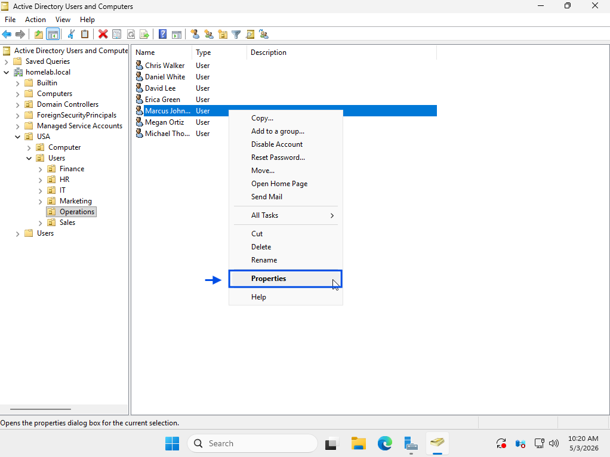

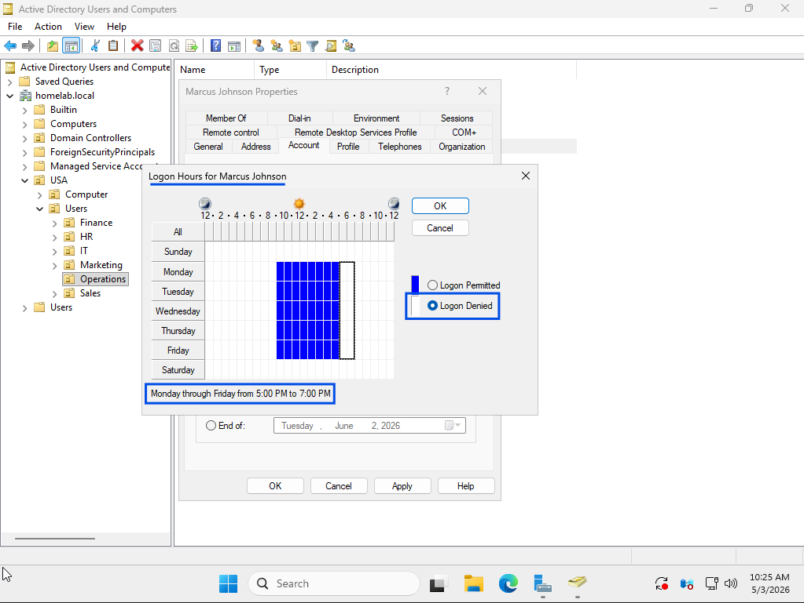
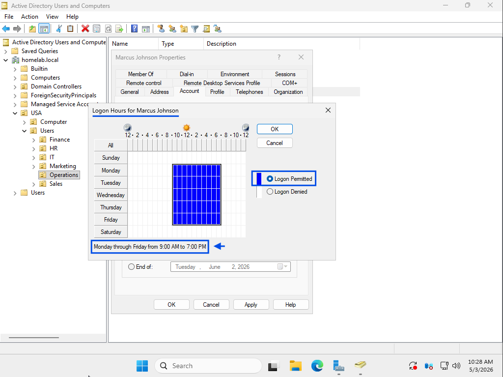

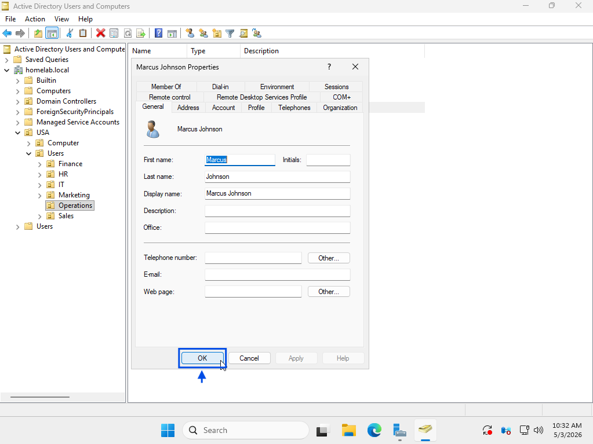

### 4. Issue Resolved (Working State)
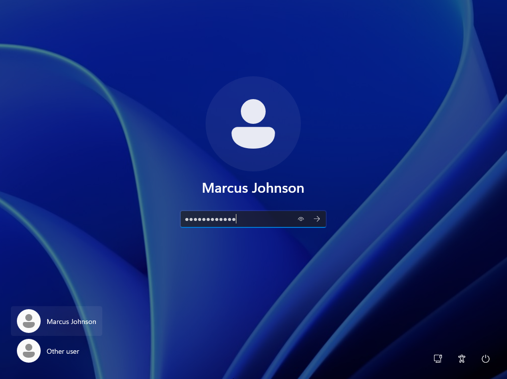
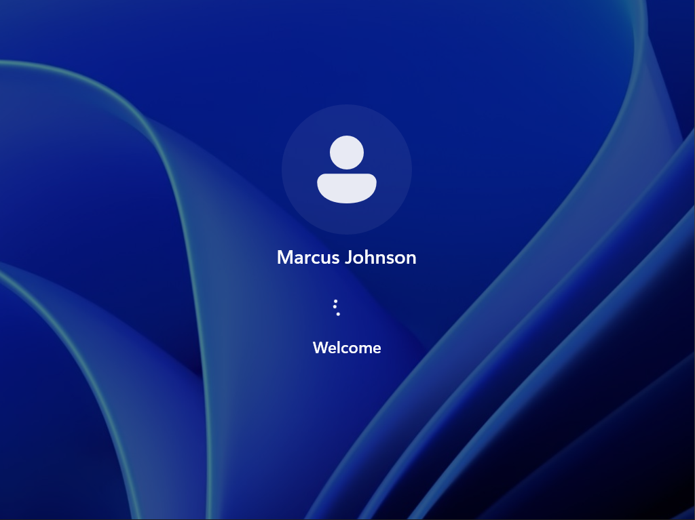
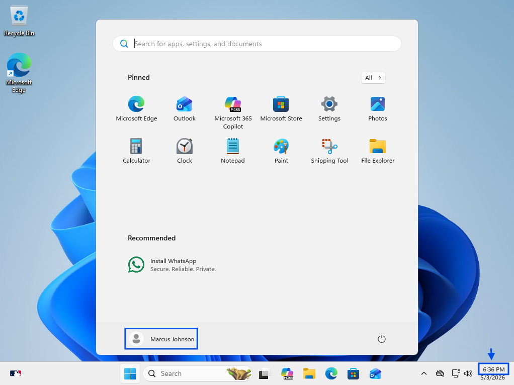
