# Domain Password Policy Error – Password Reset and Policy Correction

## Summary
Authentication issues caused by misconfigured user account password policy settings in Active Directory.

## User
Anthony Walker

## Department
Marketing

## Issue
User not prompted to change password at first logon and unable to manage credentials properly due to incorrect account configuration.

---

## Troubleshooting
- Reviewed password-related authentication issues  
- Accessed **Active Directory Users and Computers (ADUC)**  
- Located user account within appropriate OU  
- Reviewed **account policy settings**  
- Identified misconfiguration:
  - “User must change password at next logon” disabled  
  - “User cannot change password” enabled  
- Determined root cause as **incorrect password policy configuration**  
- Updated account settings to allow password management  
- Initiated password reset  

---

## Resolution
- Enabled enforced password change at next logon  
- Restored user ability to manage credentials  
- Reset password to temporary value  
- Verified successful authentication and password update  

---

## Screenshots

### 1. Ticket (Spiceworks)

### 2. Reported Issue

### 3. Troubleshooting Steps
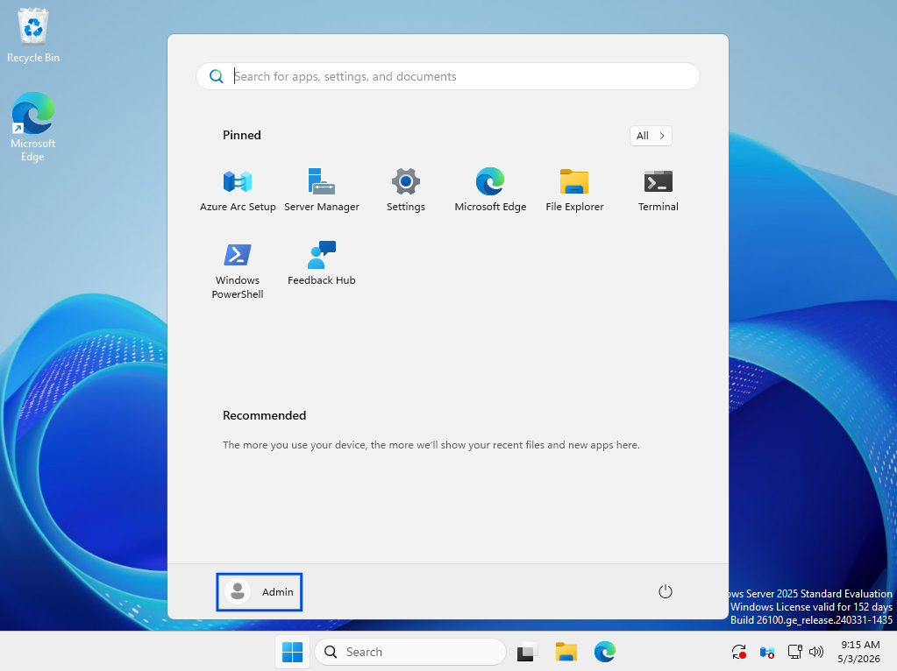
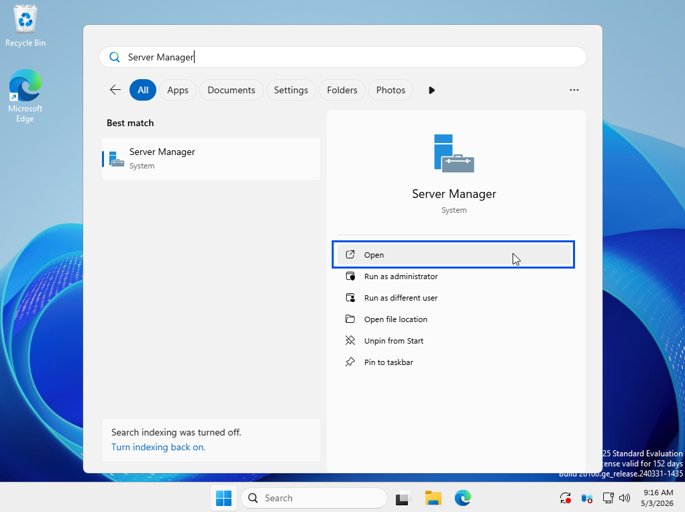
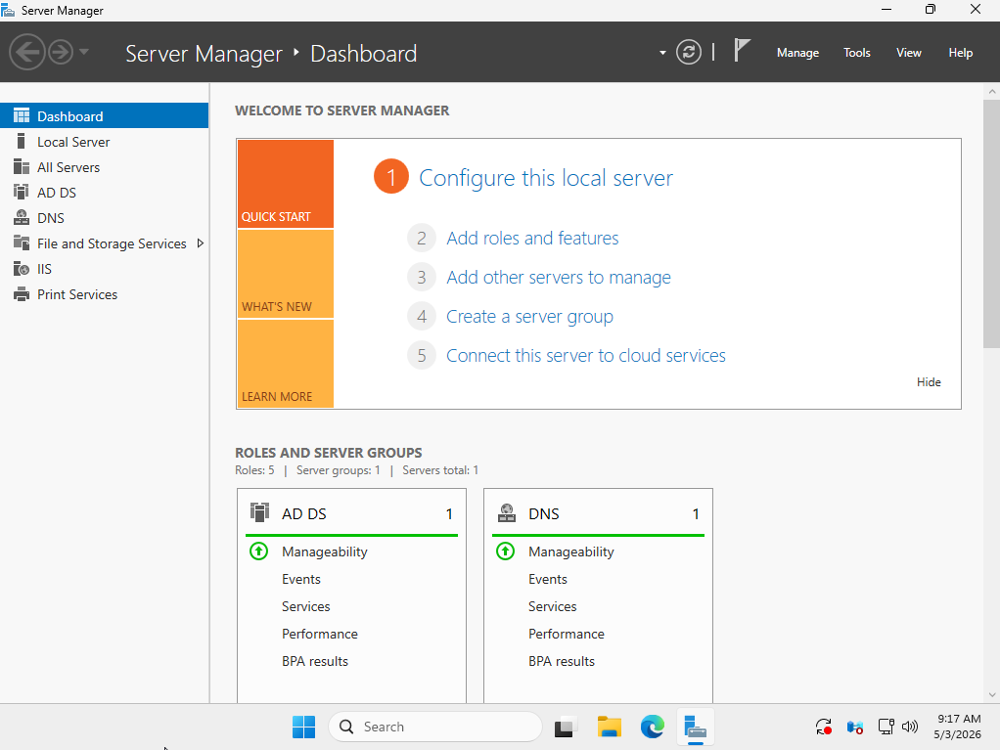
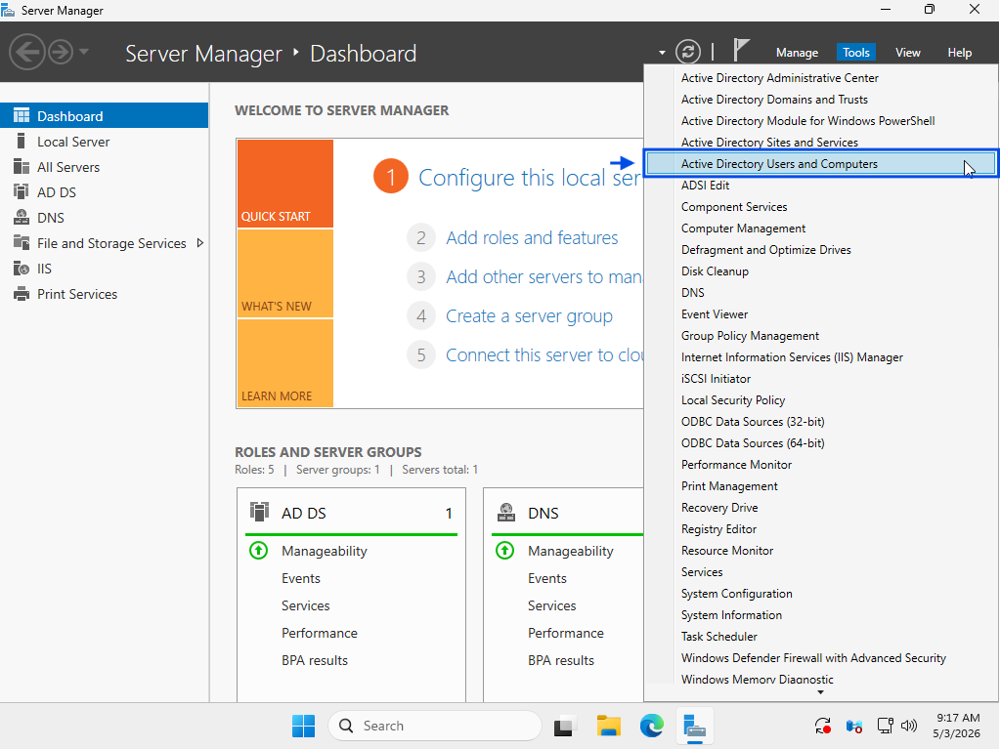
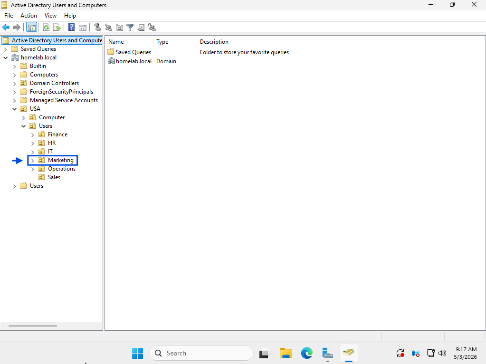
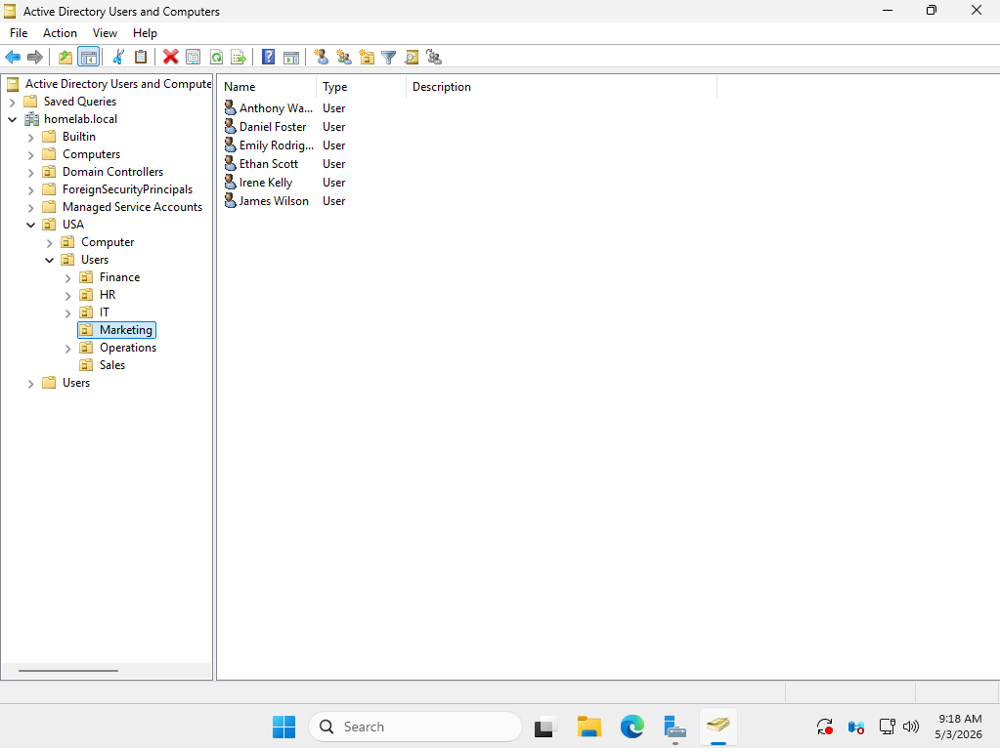
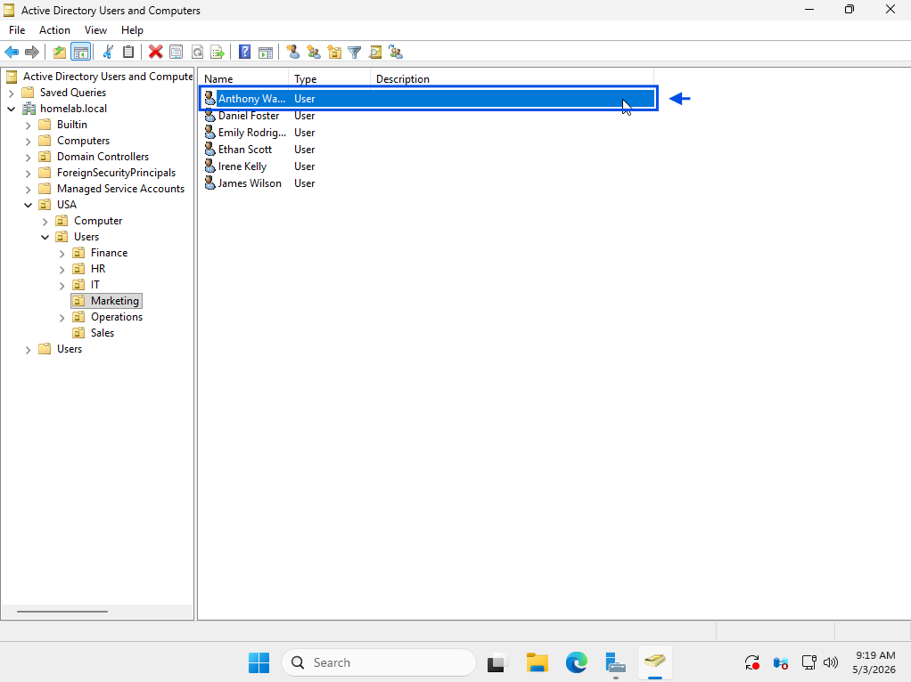
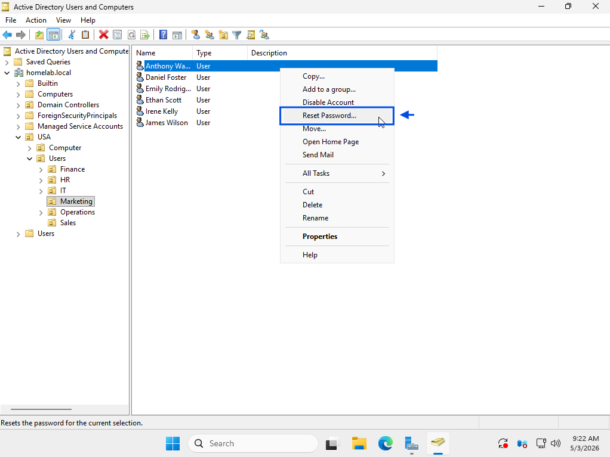
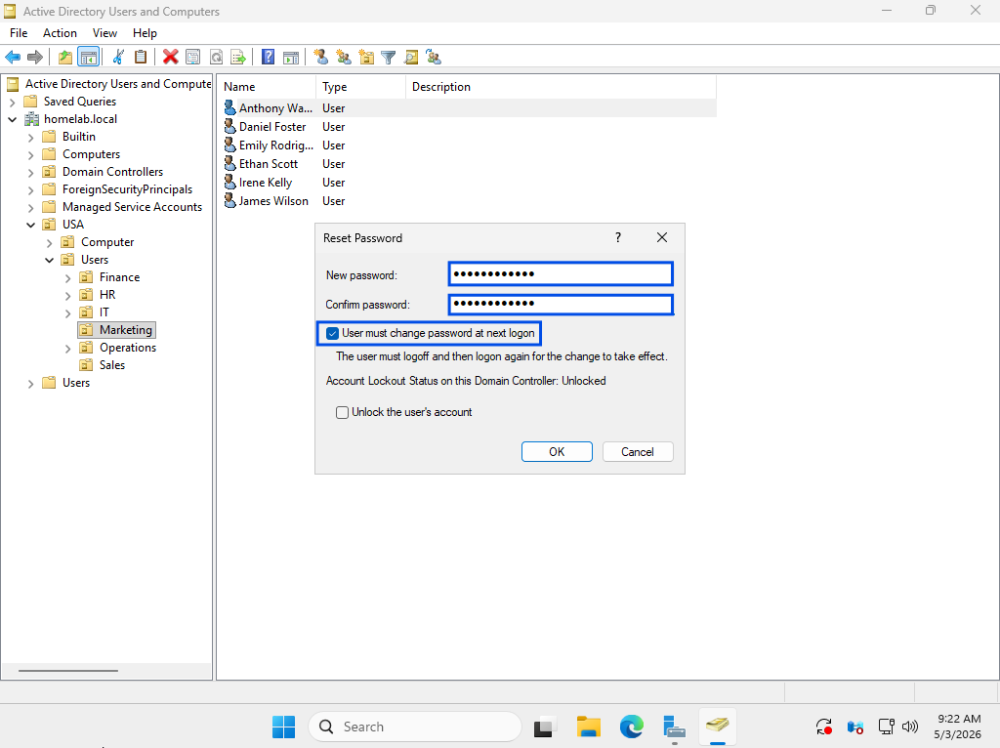
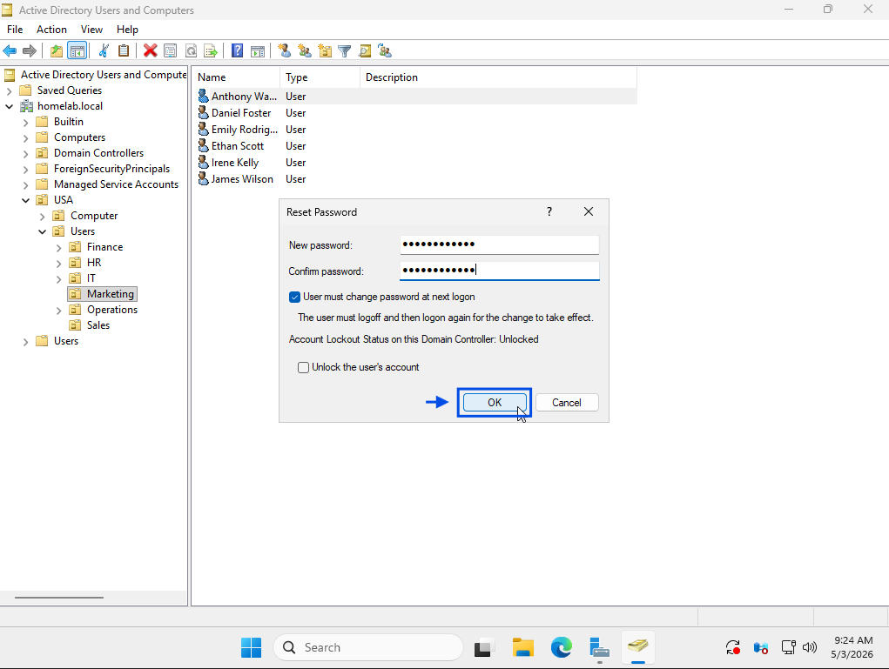
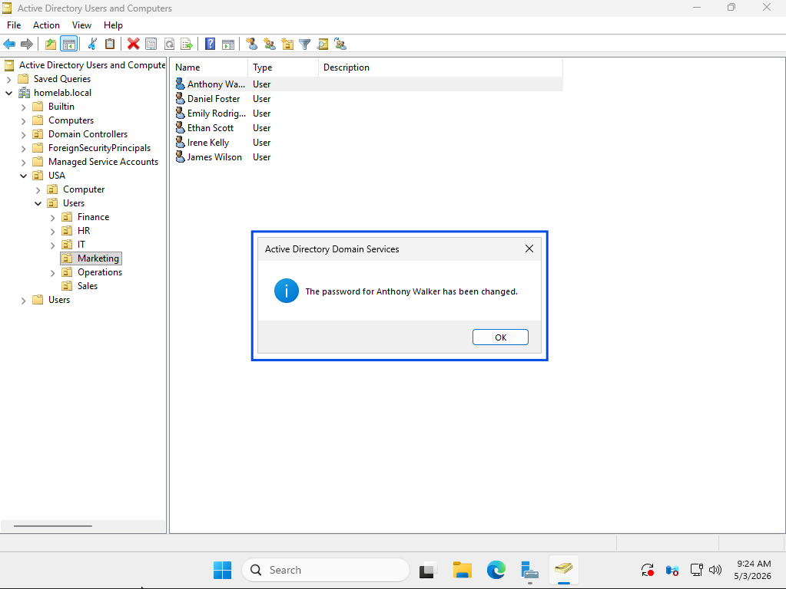
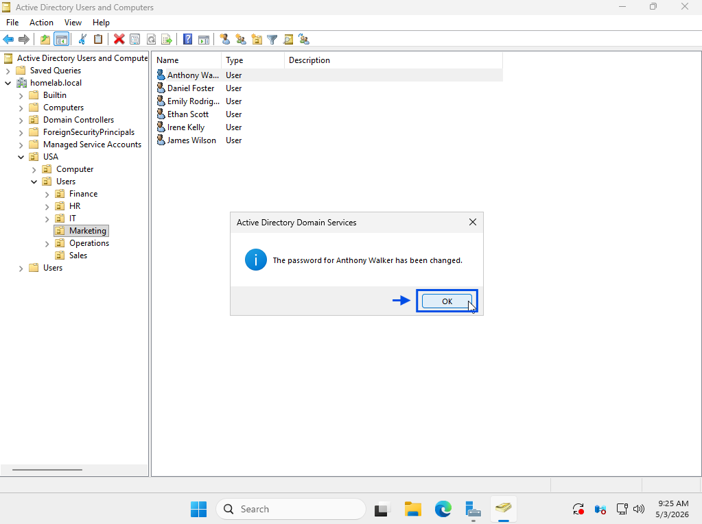

### 4. Issue Resolved (Working State)

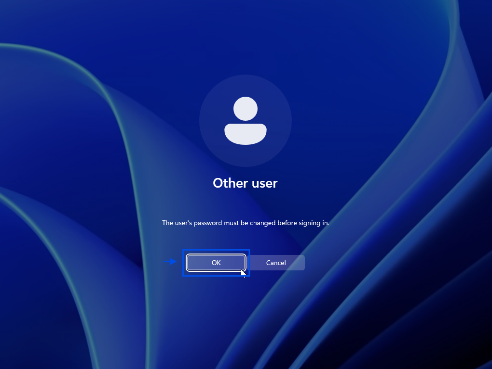

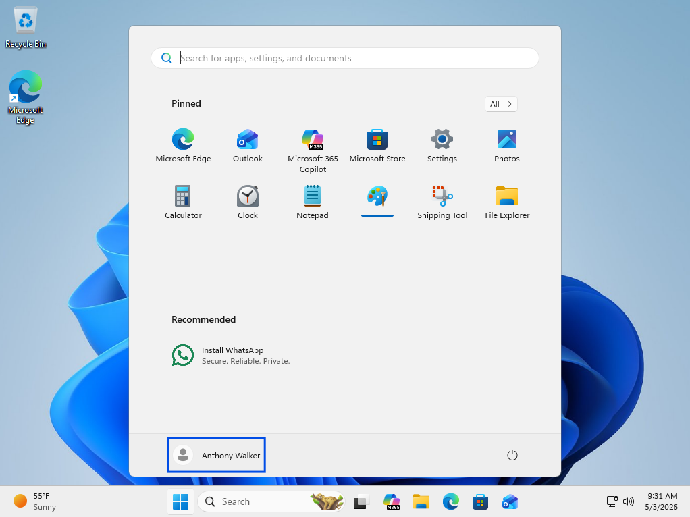
