# Active Directory User Onboarding – Account Provisioning

## Summary
User account provisioning performed in Active Directory as part of onboarding process.

## User
(New Hire) Daniel Brooks

## Department
Sales

## Issue
Request to create and configure a domain account for a new employee.

---

## Troubleshooting
- Reviewed onboarding request and required account details  
- Accessed **Active Directory Users and Computers (ADUC)**  
- Navigated to appropriate **Organizational Unit (OU)**  
- Created new user object with required attributes  
- Configured initial credentials and account options  
- Enabled **“User must change password at next logon”**  
- Verified account creation and directory placement  

---

## Resolution
- Provisioned user account within correct OU  
- Configured authentication credentials and initial access settings  
- Validated successful login on domain-joined system  
- Confirmed account readiness for production use  

---

## Screenshots

### 1. Ticket (Spiceworks)
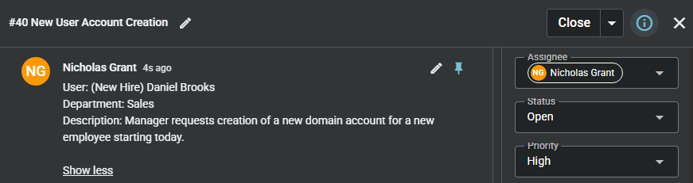

### 2. User Creation Process (Active Directory)

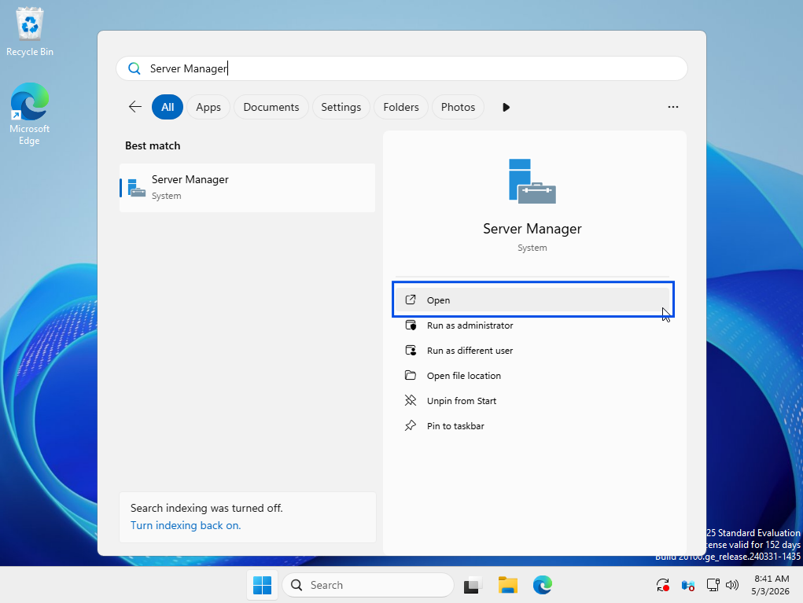

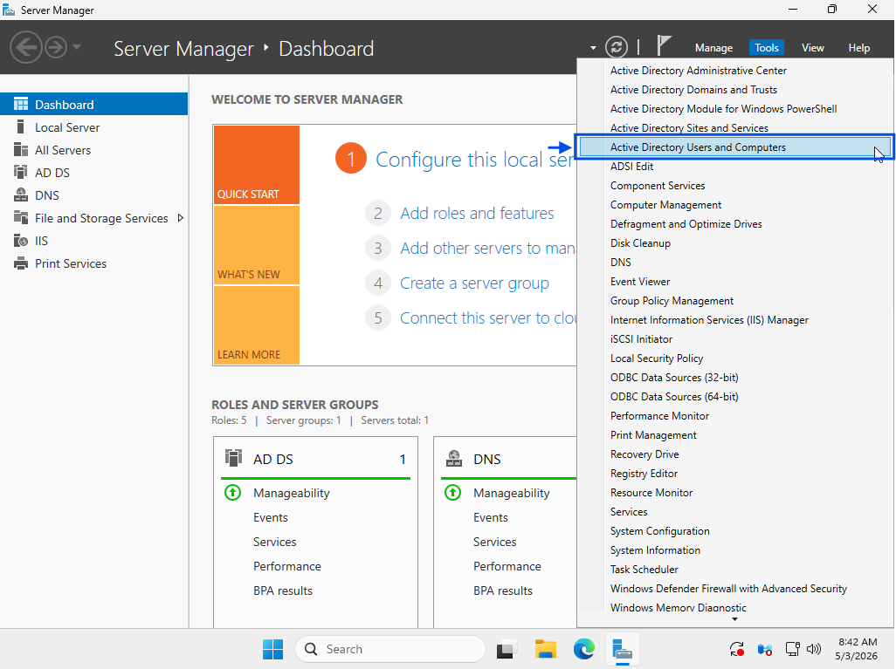

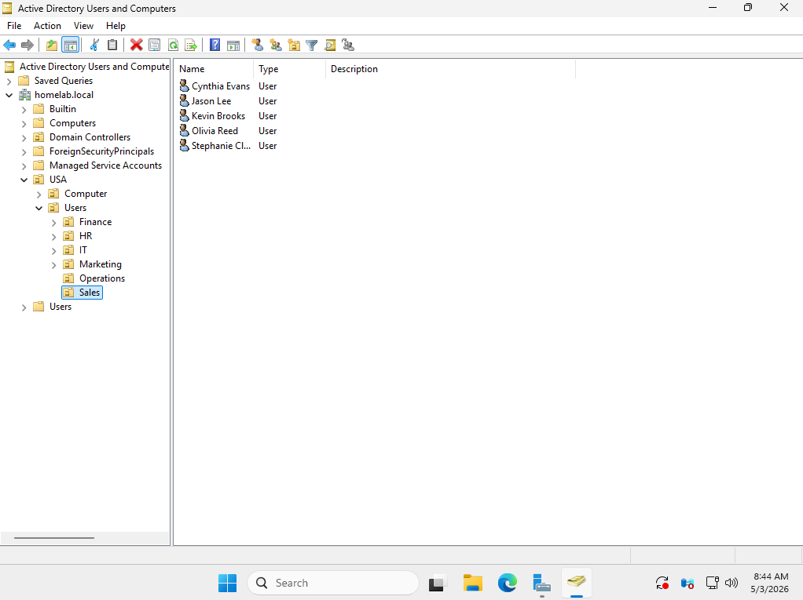

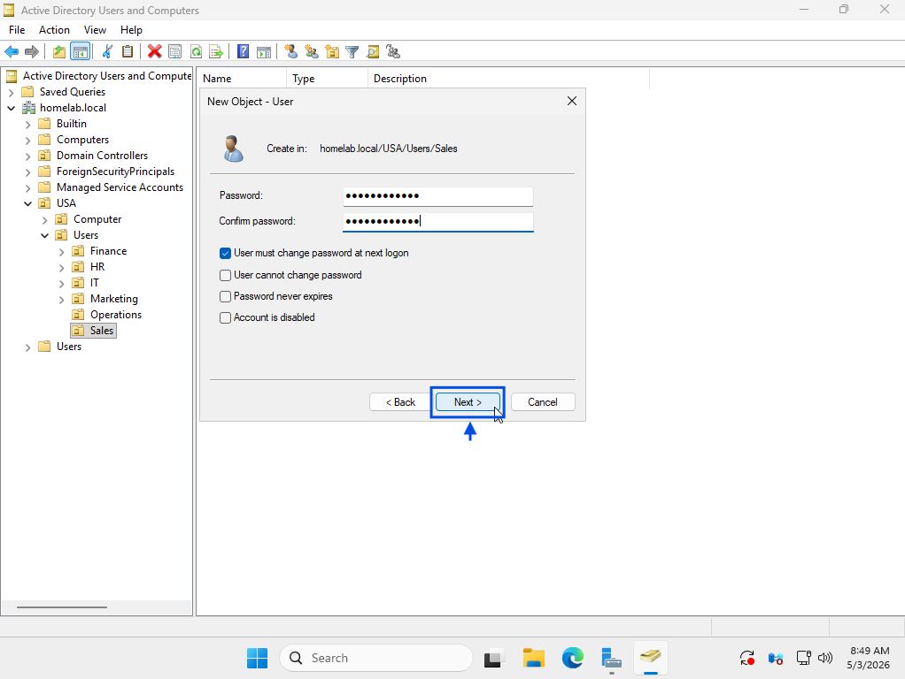
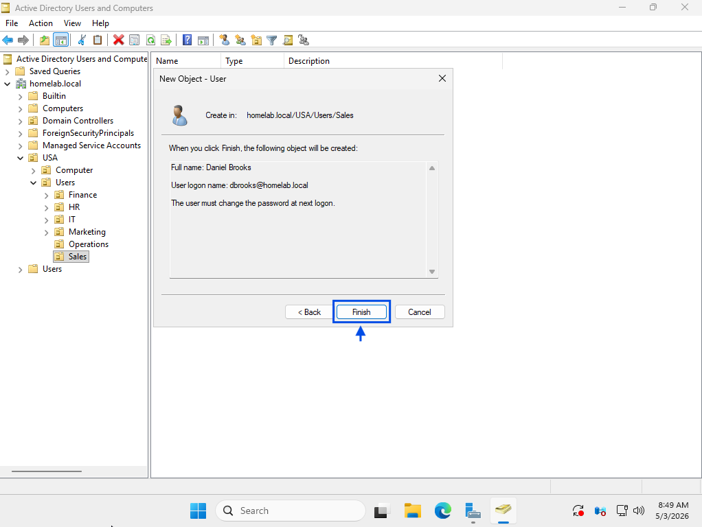
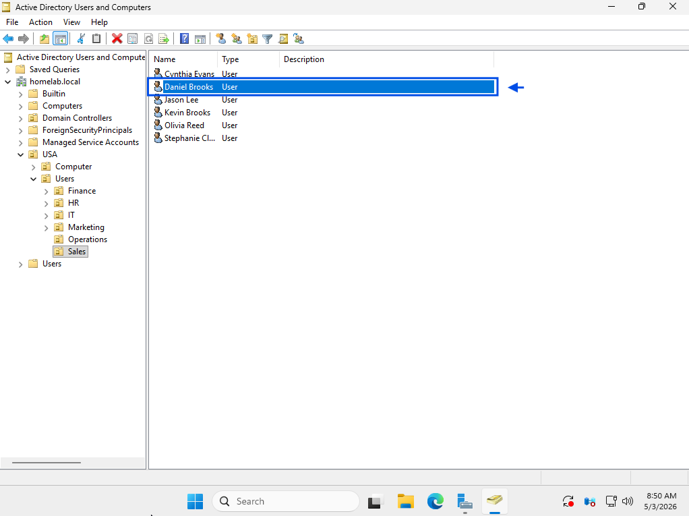

### 3. Resolution (Working State)
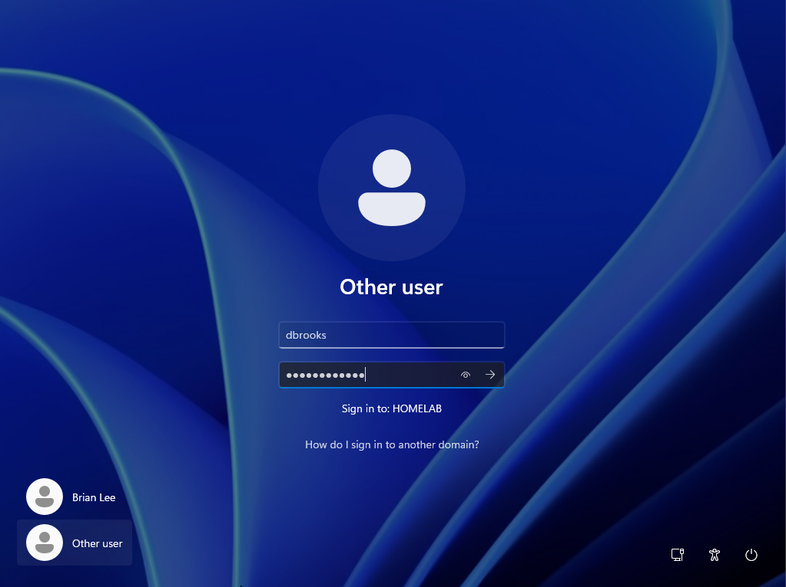
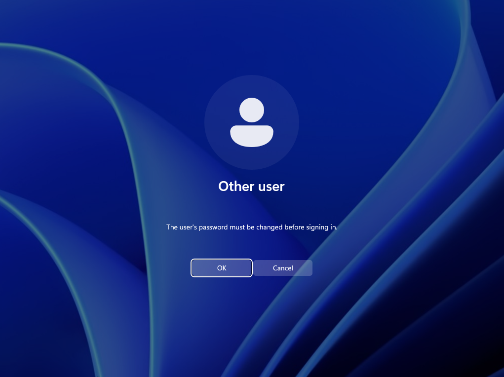
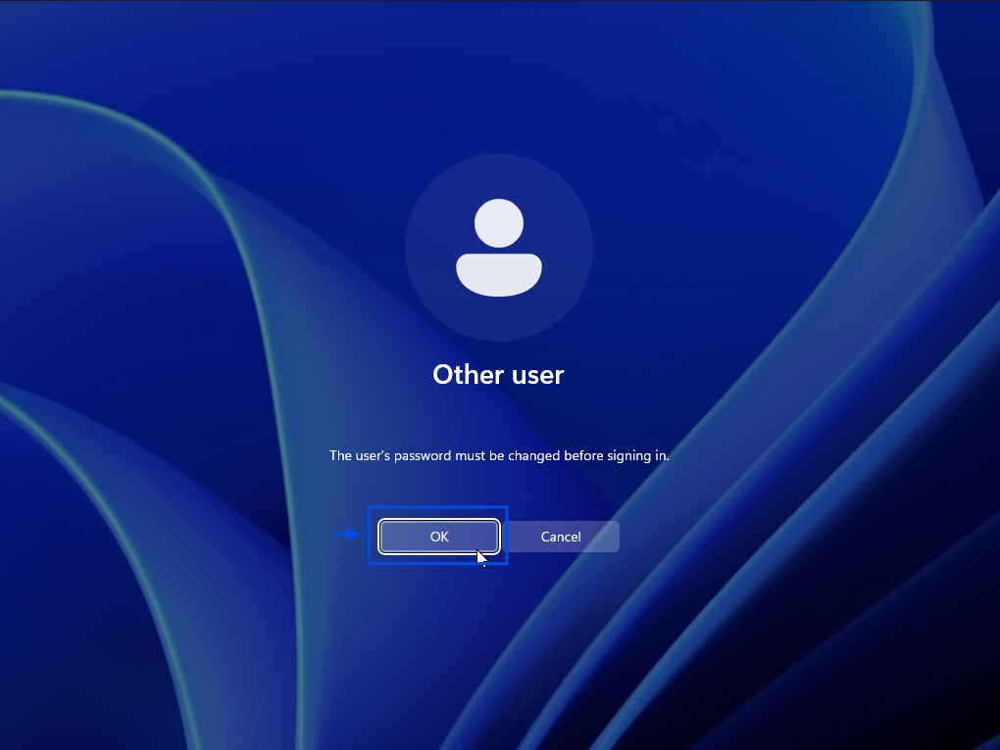

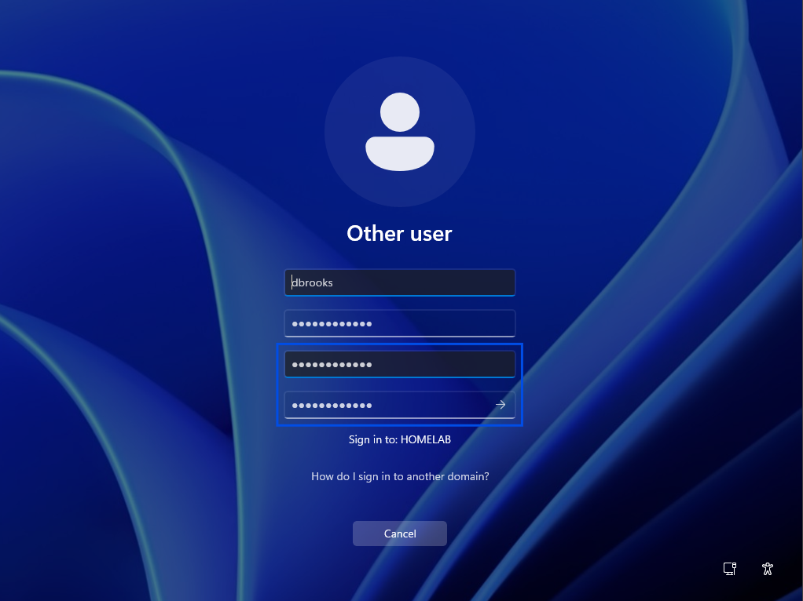
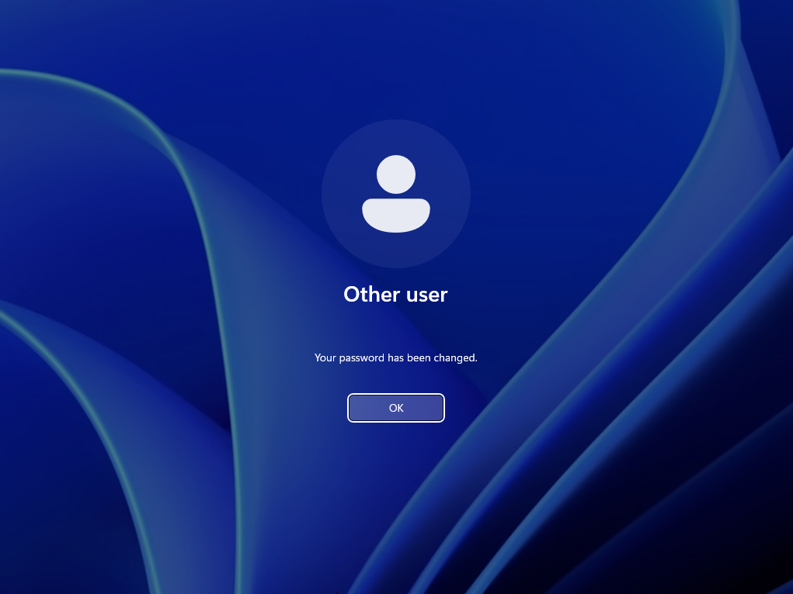
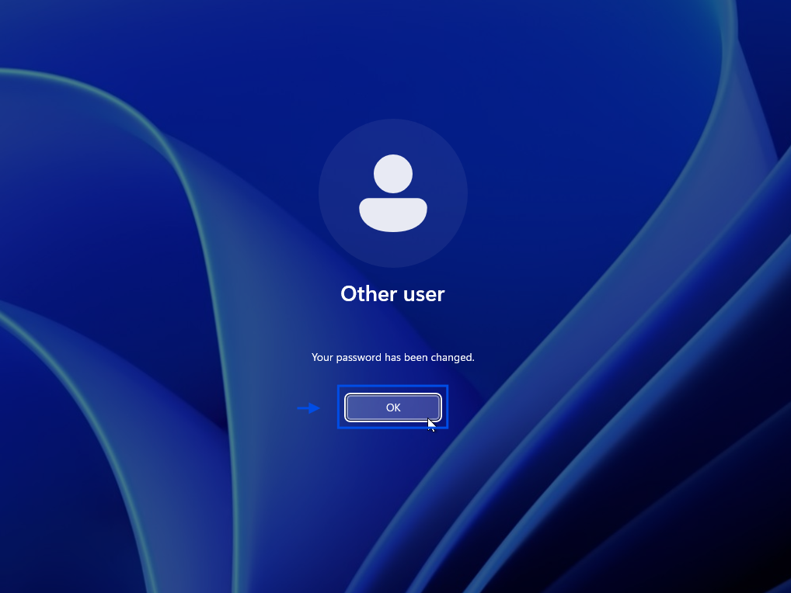

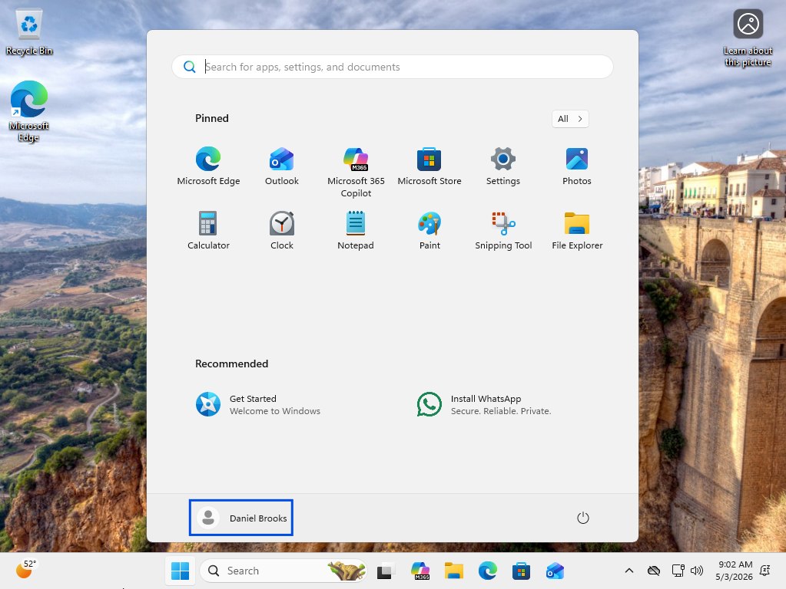
