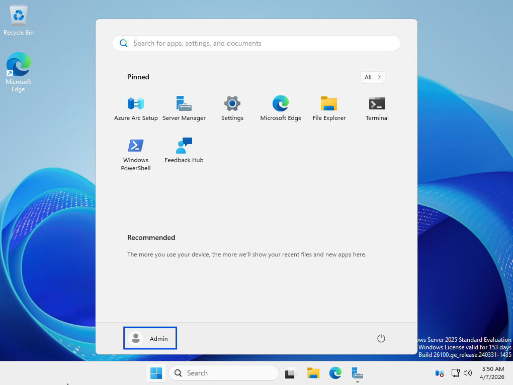
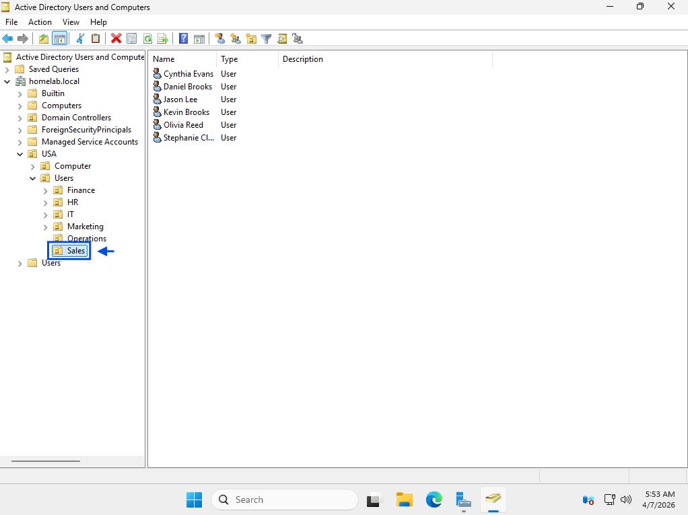

# Account Lockout

## Summary
User unable to log in due to account lockout.

## User
Cynthia Evans

## Department
Sales

## Issue
User reports receiving error: "The referenced account is currently locked out and may not be logged on to."  
User confirms multiple failed login attempts prior to issue.

---

## Troubleshooting
- Reviewed user-reported error message
- Identified account lockout due to failed login attempts
- Opened Active Directory Users and Computers
- Located user account
- Checked account status in user properties
- Confirmed account was locked out
- Unlocked user account
- Initiated password reset for user

---

## Resolution
- Unlocked user account in Active Directory
- Reset user password
- Applied changes and confirmed account status
- User successfully logged in with new credentials

---

## Screenshots

### 1. Ticket (Spiceworks)

### 2. Reported Issue

### 3. Troubleshooting Steps

### 4. Issue Resolved (Working State)

