# Incorrect Folder Permissions

## Summary
User has unauthorized access to restricted folder due to incorrect permissions.

## User
Brian Lee

## Department
Operations

## Issue
User reports visibility and access to Finance Management folder, which should be restricted to Finance management team only.

---

## Troubleshooting
- Reviewed user-reported unauthorized folder access
- Confirmed user able to view restricted directory
- Identified access violation based on department role
- Accessed file server hosting shared folder
- Opened folder properties
- Navigated to Sharing settings
- Reviewed shared permissions
- Identified user listed with access permissions
- Determined permissions misconfiguration

---

## Resolution
- Removed user from shared folder permissions
- Applied updated permission settings
- Verified user no longer has access to restricted folder
- Confirmed folder no longer visible on client machine

---

## Screenshots

### 1. Ticket (Spiceworks)

### 2. Reported Issue

### 3. Troubleshooting Steps

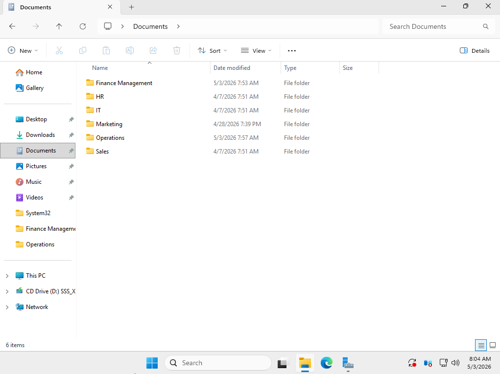
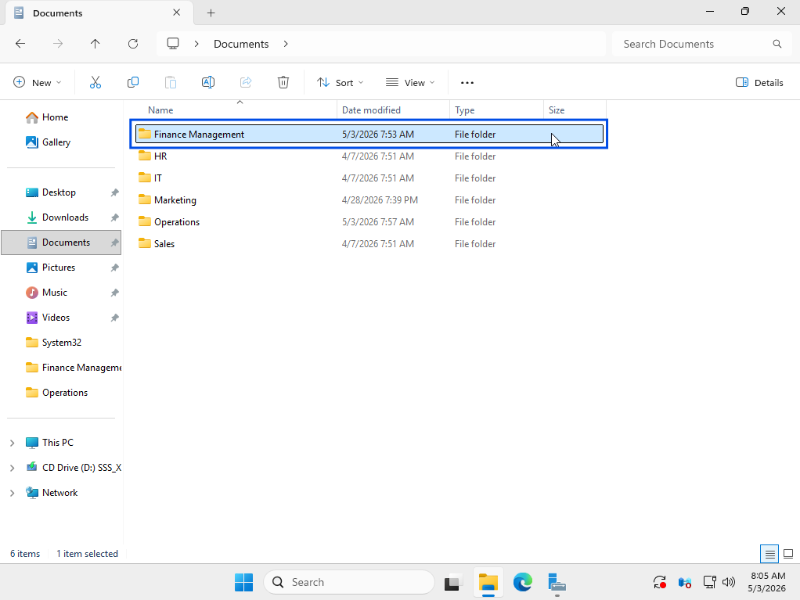
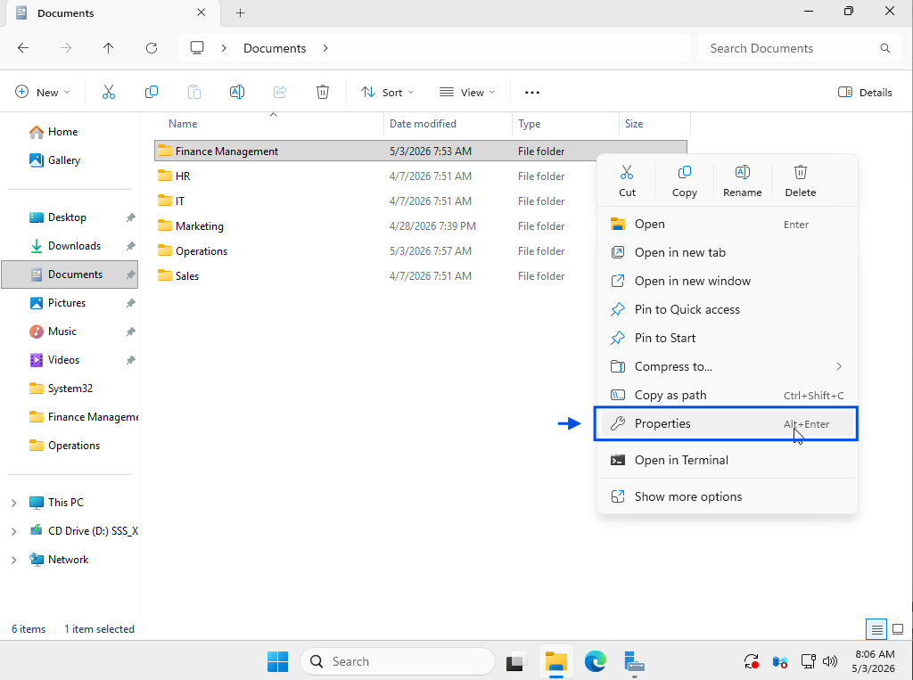

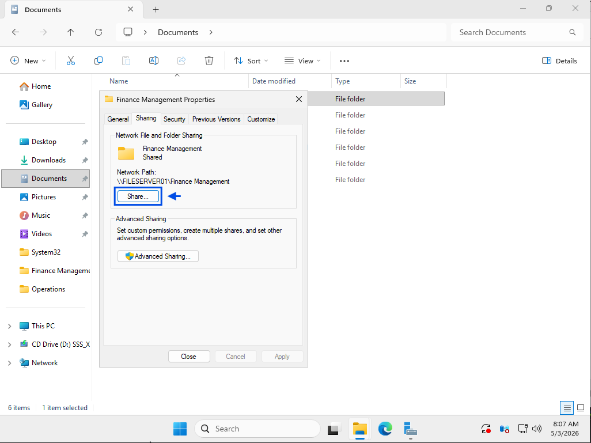
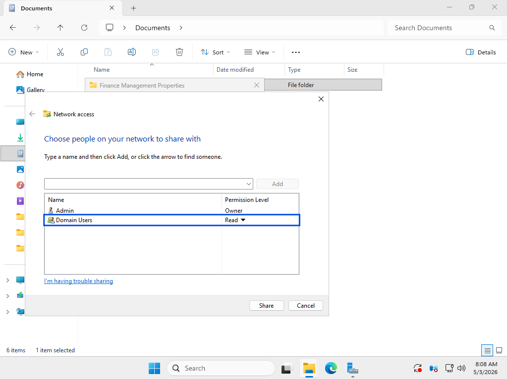

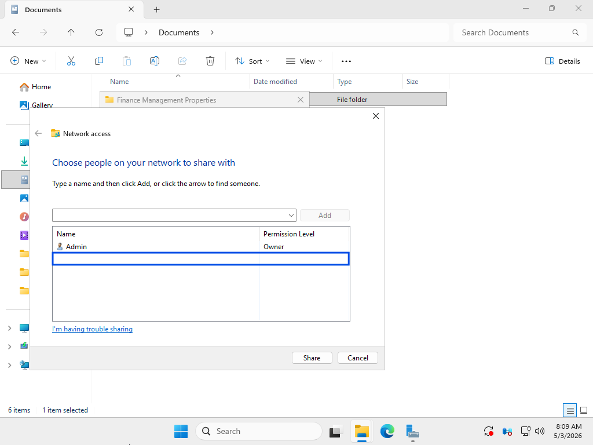
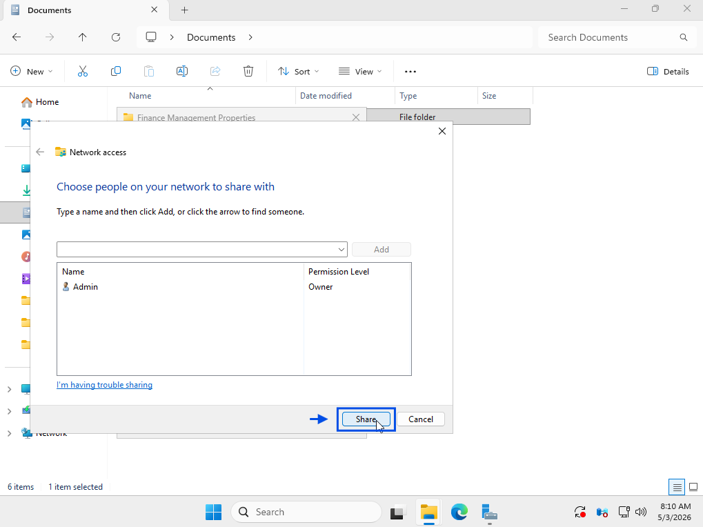
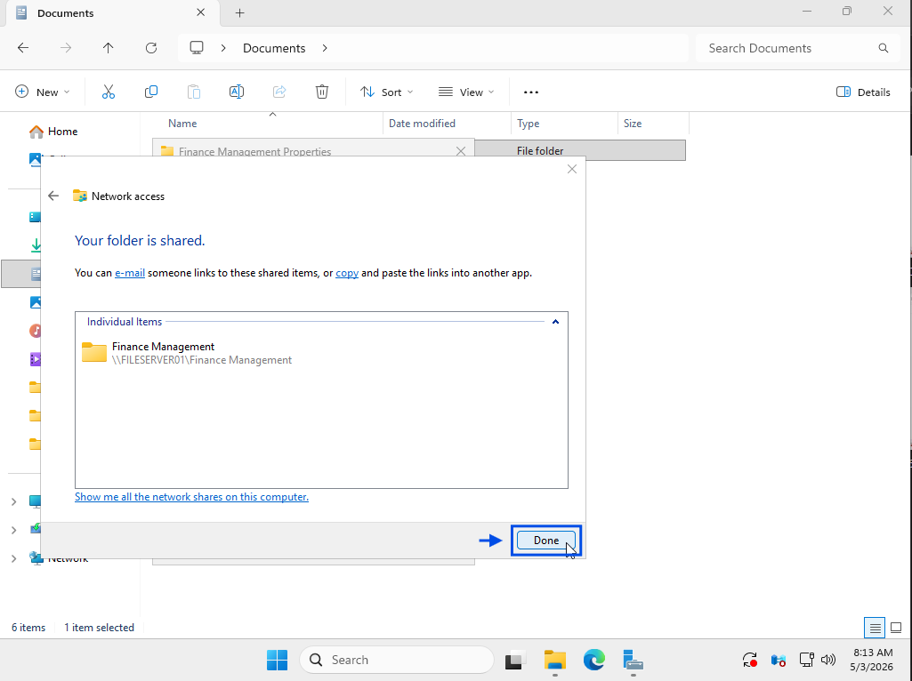

### 4. Issue Resolved (Working State)

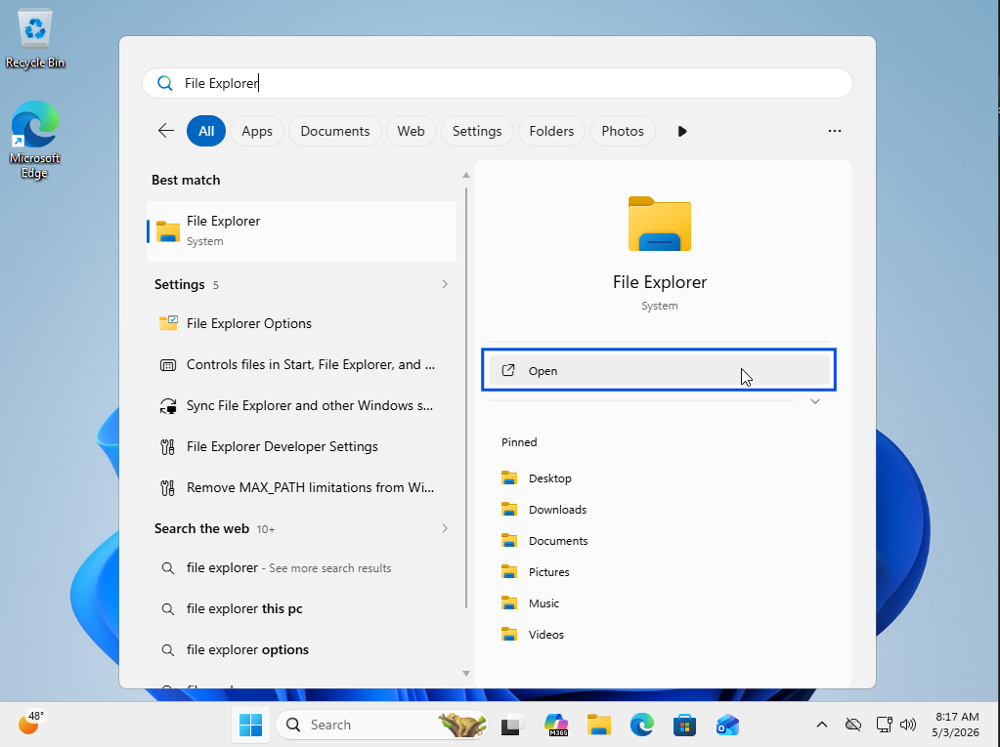

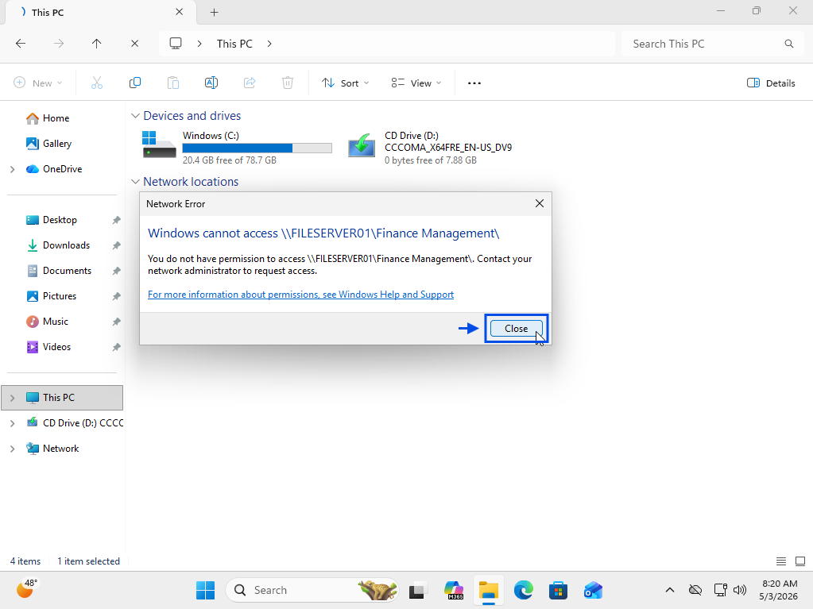

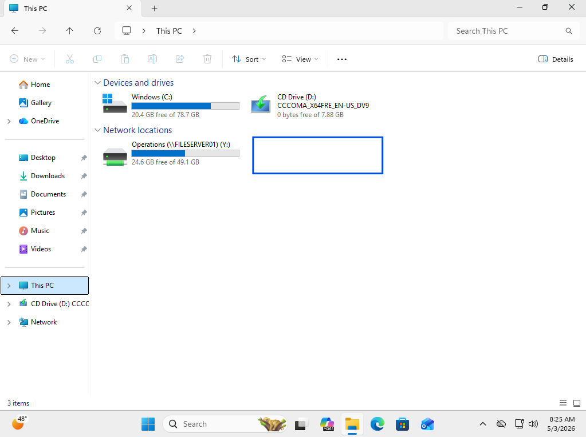
