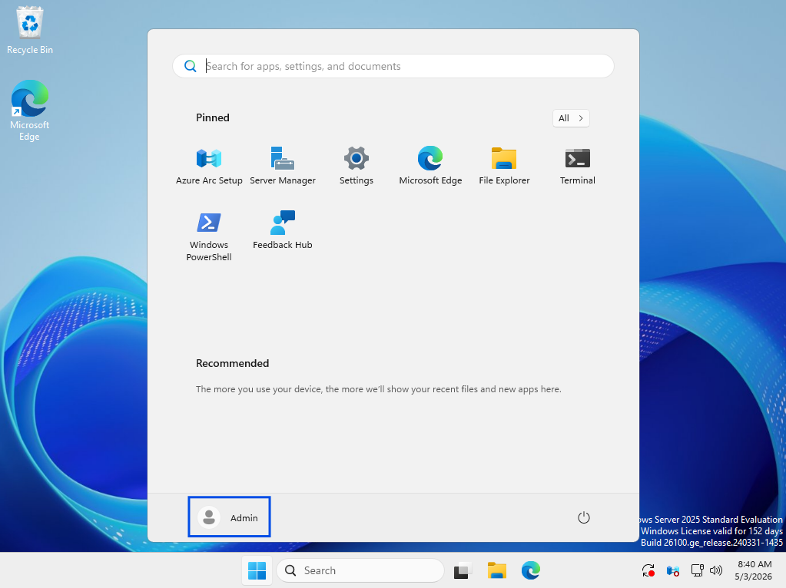
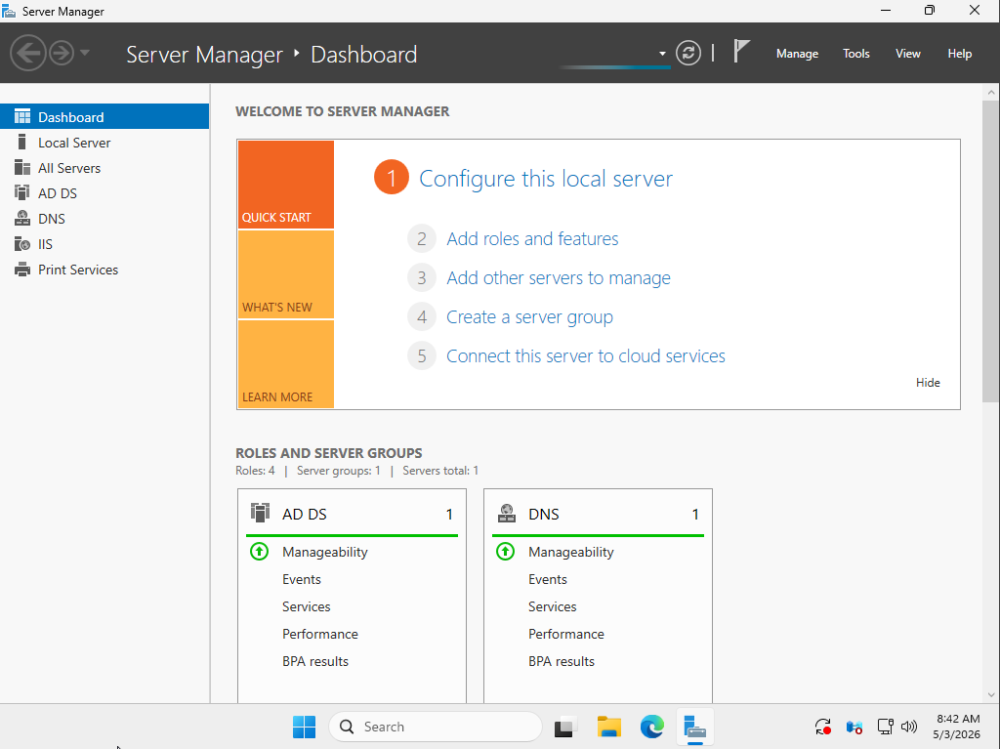
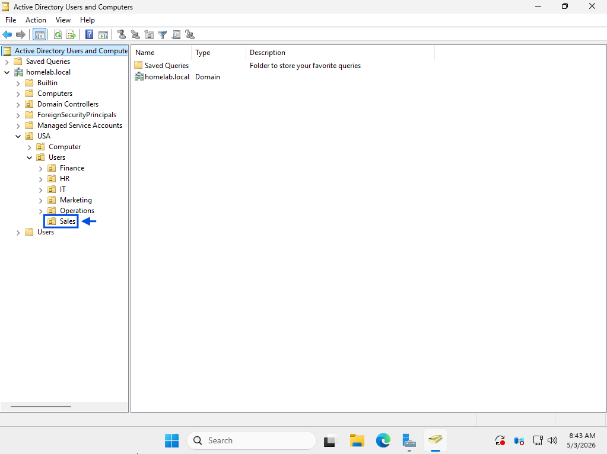
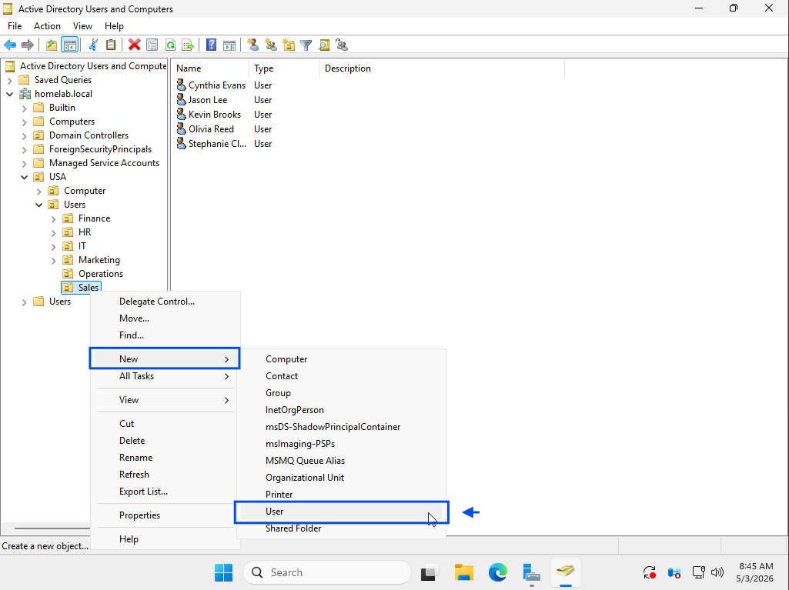
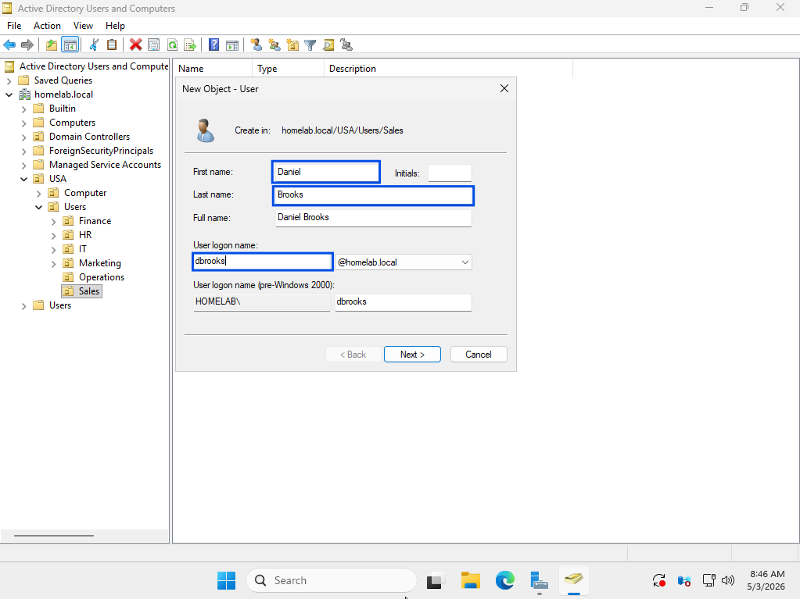
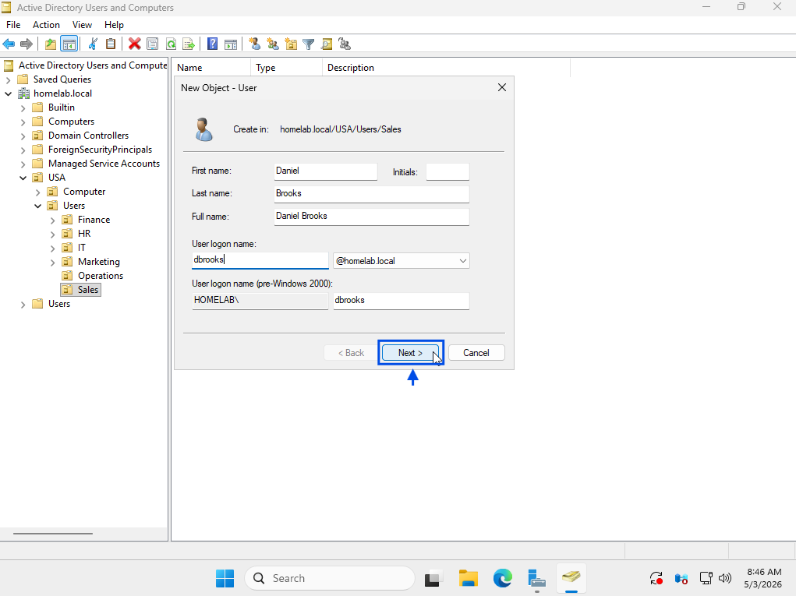
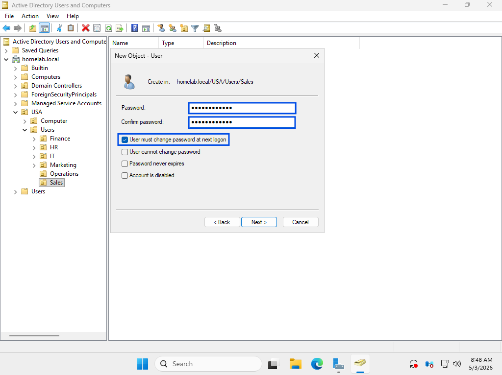
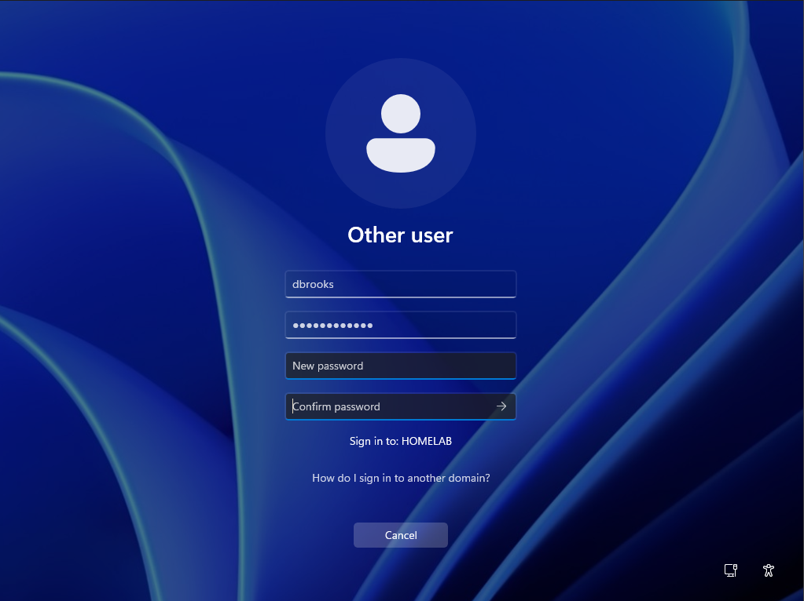

# New User Account Creation

## Summary
Created new Active Directory user account for onboarding.

## User
(New Hire) Daniel Brooks

## Department
Sales

## Issue
Manager requested creation of a new domain account for a new employee.

---

## Troubleshooting
- Reviewed account creation request
- Accessed Active Directory Users and Computers
- Navigated to Sales Organizational Unit (OU)
- Initiated new user object creation
- Entered user details and username
- Configured initial password
- Set account options for first login
- Completed user account creation
- Verified account exists in domain

---

## Resolution
- Created new user account in Active Directory
- Assigned user to correct Organizational Unit (Sales)
- Configured login credentials
- Confirmed successful login on domain-joined machine
- Verified account ready for use

---

## Screenshots

### 1. Ticket (Spiceworks)

### 2. User Creation Process (Active Directory)

### 3. Resolution (Working State)

