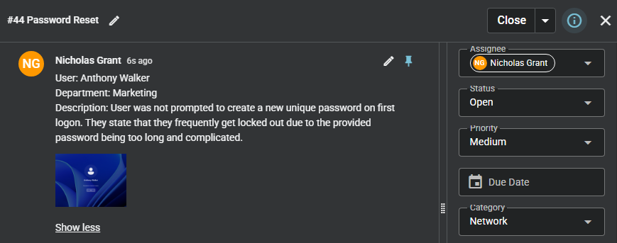
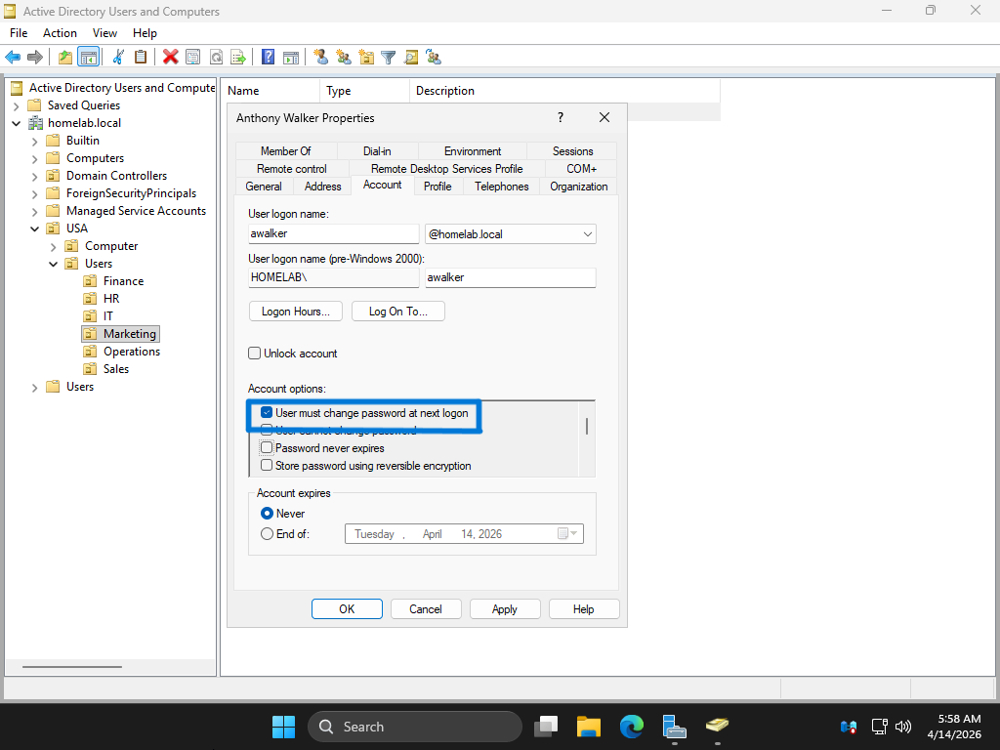
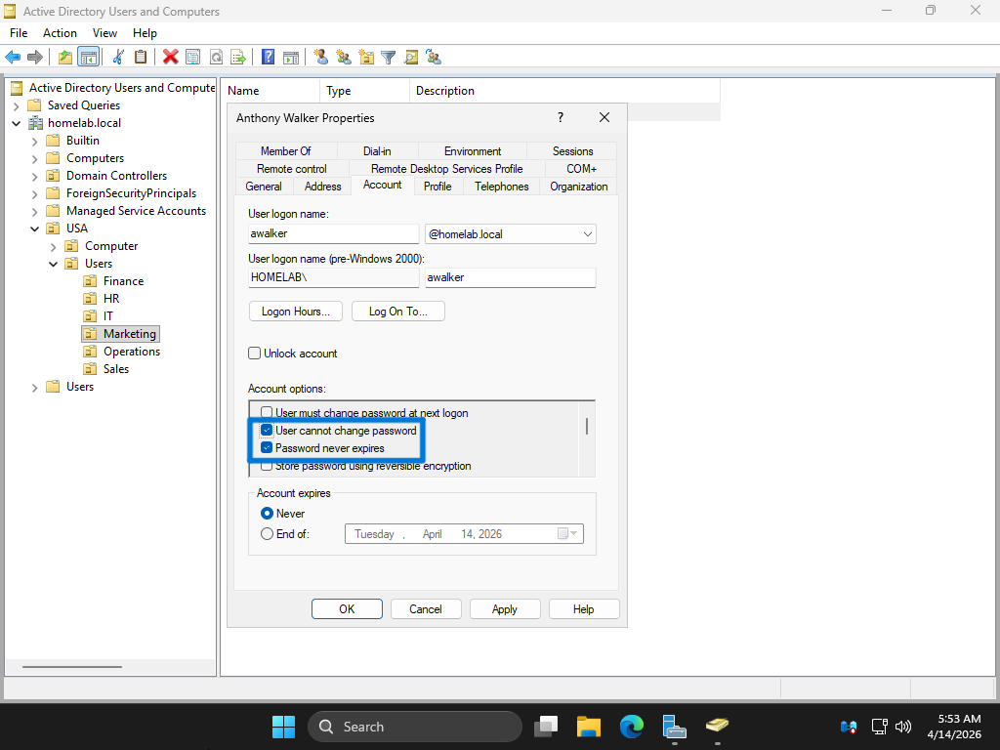
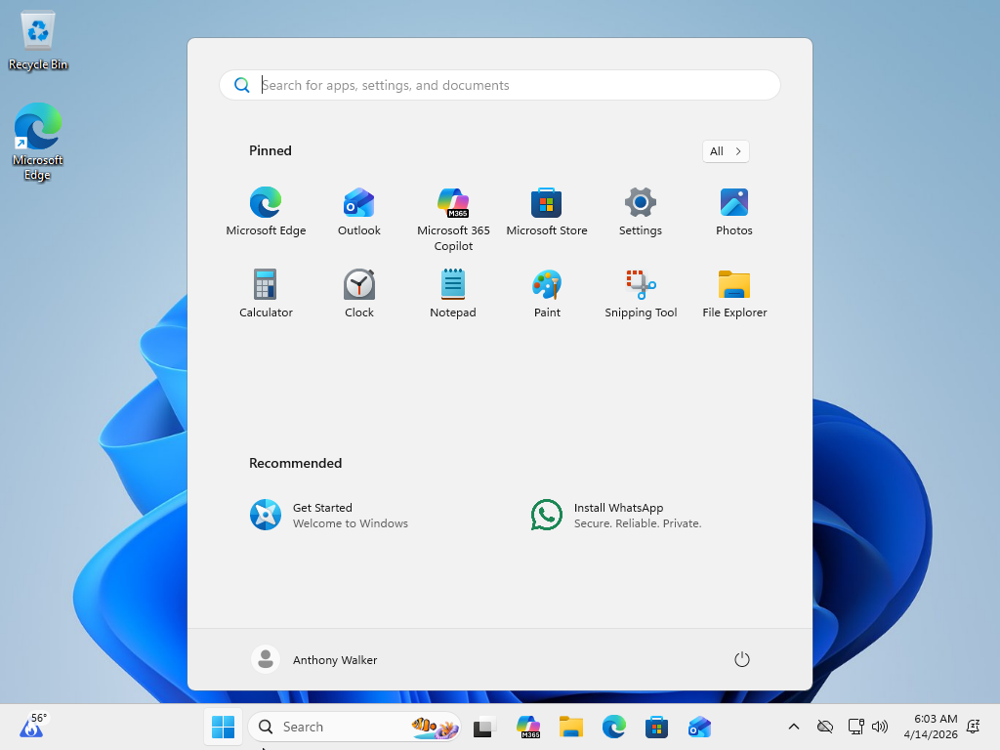

# Password Reset

## Summary
User unable to properly manage password due to incorrect account settings.

## User
Anthony Walker

## Department
Marketing

## Issue
User reports not being prompted to change password at first logon.  
User also experiences frequent login issues due to complex password requirements.

---

## Troubleshooting
- Reviewed user-reported password issue
- Accessed Active Directory Users and Computers
- Navigated to Marketing Organizational Unit (OU)
- Located user account
- Opened account properties
- Navigated to Account settings
- Verified "User must change password at next logon" was disabled
- Verified "User cannot change password" was enabled
- Identified misconfigured password policy settings
- Updated account options to allow password change
- Enabled password change at next logon
- Reset user password

---

## Resolution
- Enabled "User must change password at next logon"
- Disabled "User cannot change password"
- Reset user password to temporary credential
- Allowed user to create new password
- Confirmed successful login with updated credentials

---

## Screenshots

### 1. Ticket (Spiceworks)

### 2. Reported Issue

### 3. Troubleshooting Steps

### 4. Issue Resolved (Working State)

