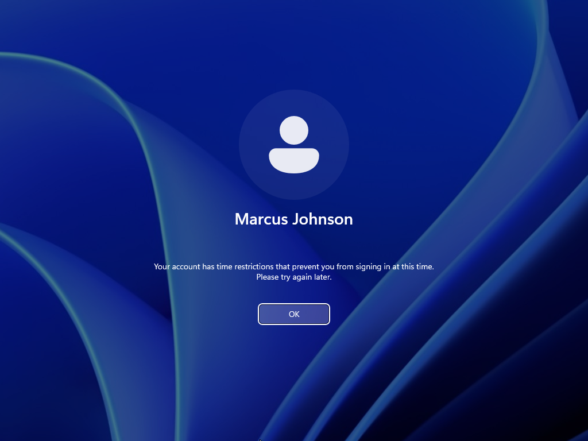
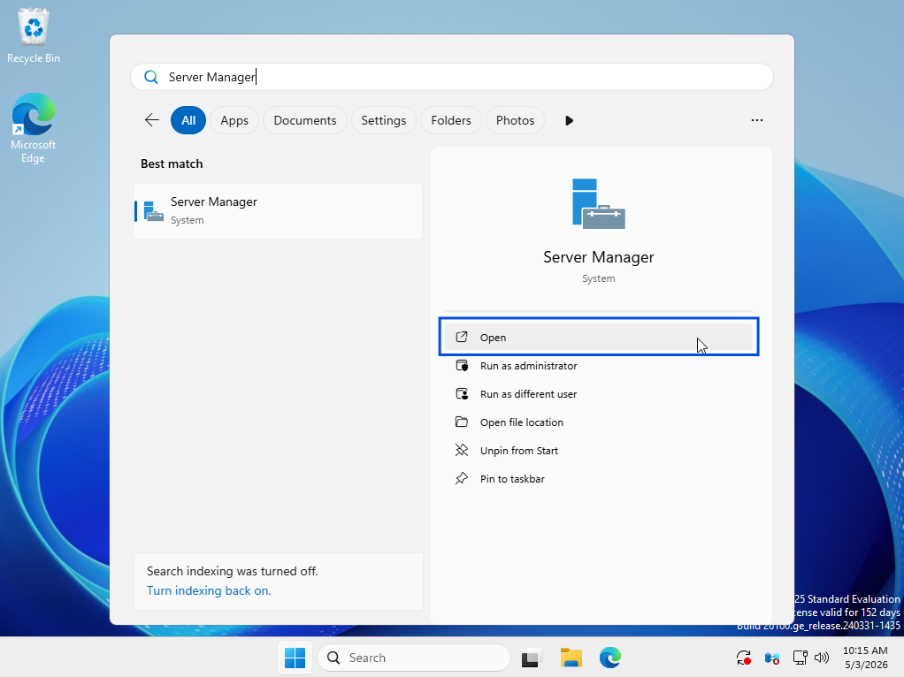
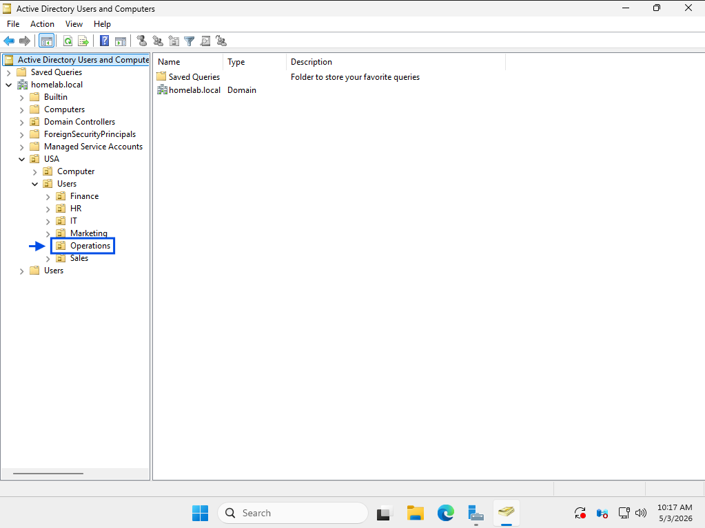
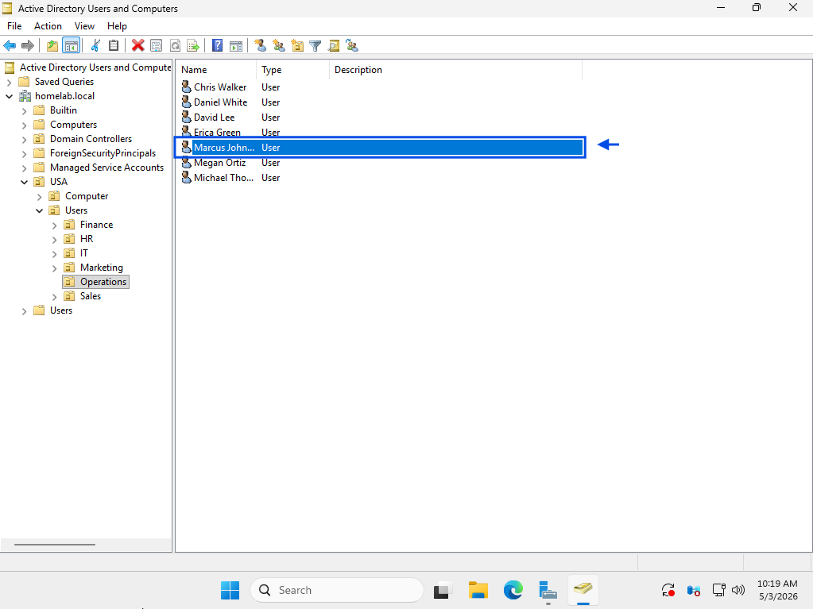
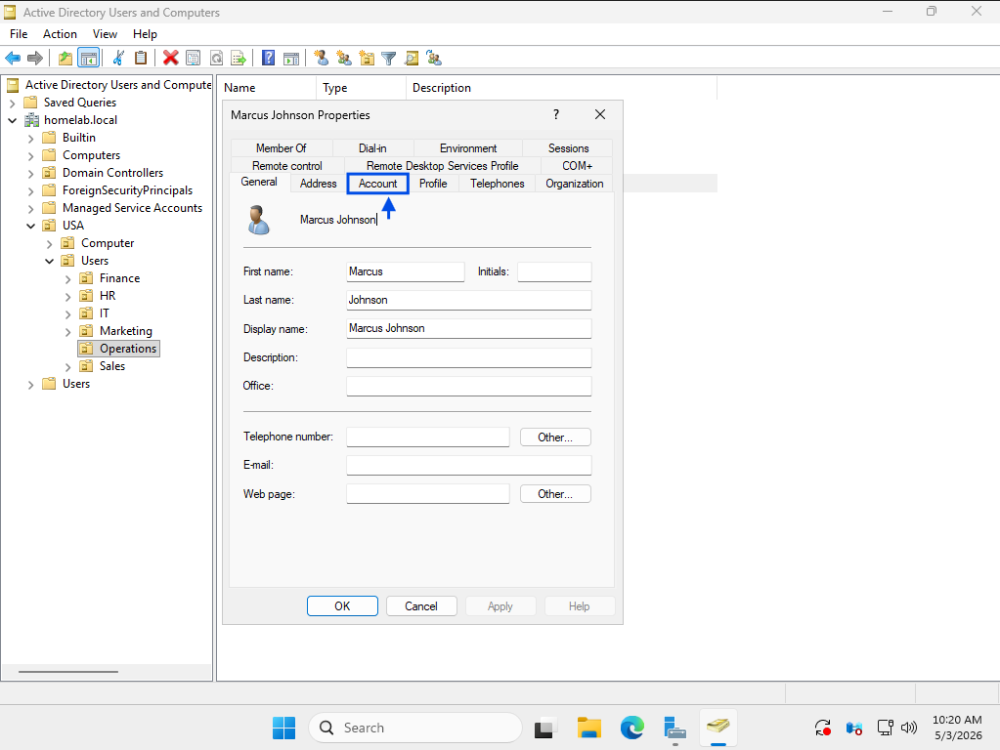
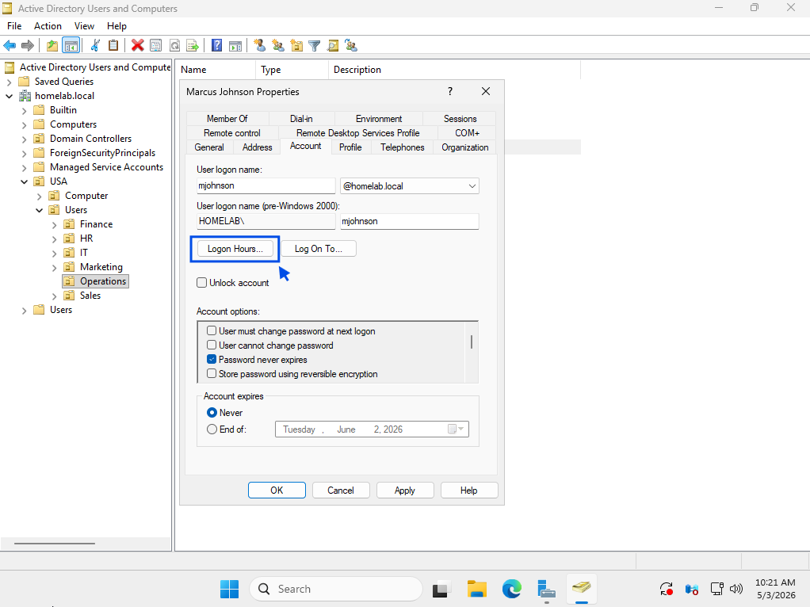
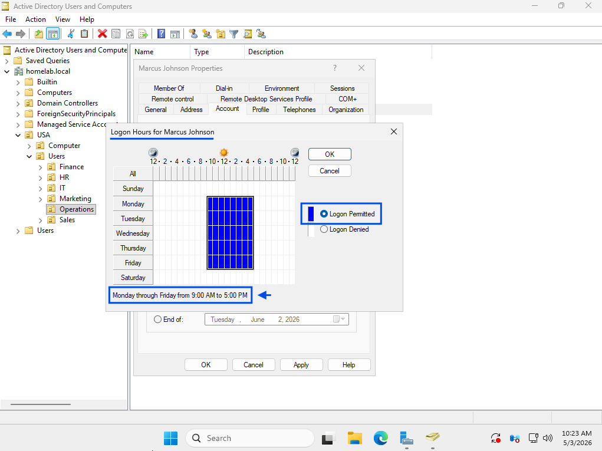
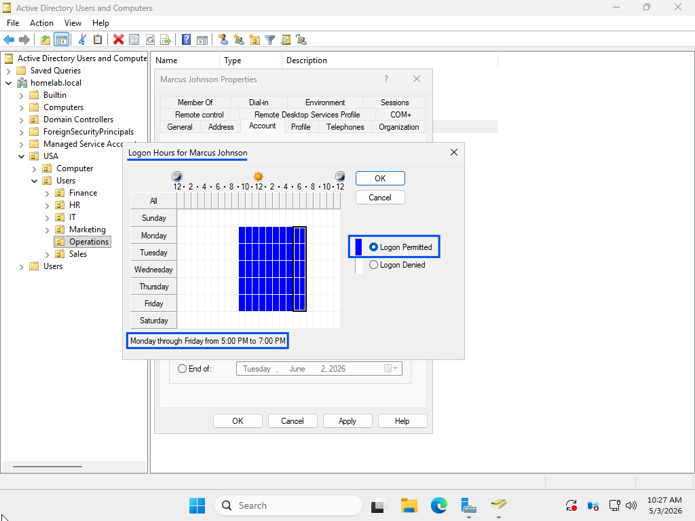
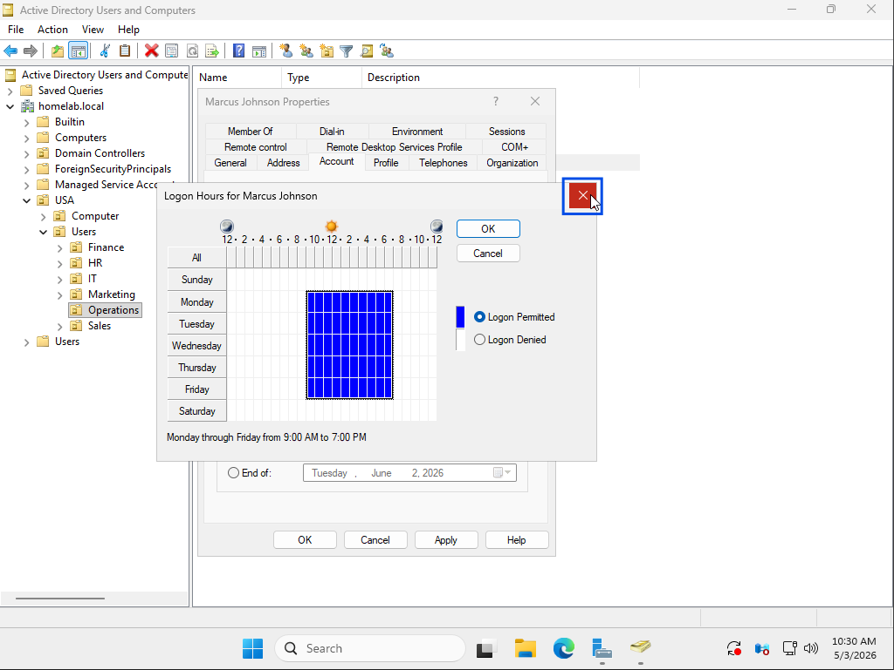
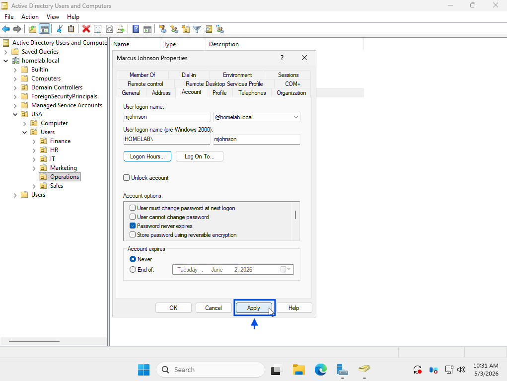

# Update Logon Hours

## Summary
User unable to log in outside approved hours due to logon hour restrictions.

## User
Marcus Johnson

## Department
Operations

## Issue
User reports inability to log in after business hours despite correct credentials.  
User was approved for extended access to complete work.

---

## Troubleshooting
- Reviewed user-reported login issue
- Identified login attempt occurring outside standard business hours
- Determined issue related to logon hour restrictions
- Accessed Active Directory Users and Computers
- Navigated to Operations Organizational Unit (OU)
- Located user account
- Opened account properties
- Accessed Logon Hours settings
- Reviewed existing logon hour restrictions
- Identified restricted access outside business hours
- Updated logon hours to reflect approved access window

---

## Resolution
- Modified user logon hours in Active Directory
- Extended access to approved after-hours timeframe
- Applied updated logon hour settings
- Verified user can authenticate outside standard hours
- Confirmed successful login after policy update

---

## Screenshots

### 1. Ticket (Spiceworks)

### 2. Reported Issue

### 3. Troubleshooting Steps

### 4. Issue Resolved (Working State)

